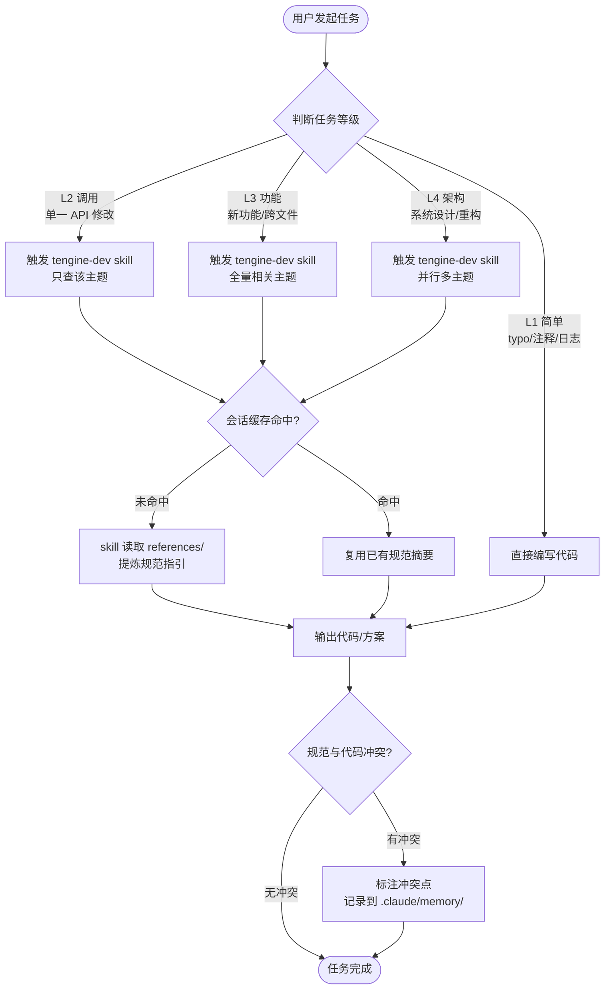
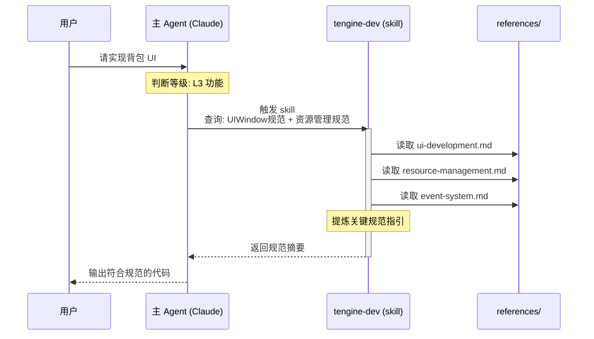
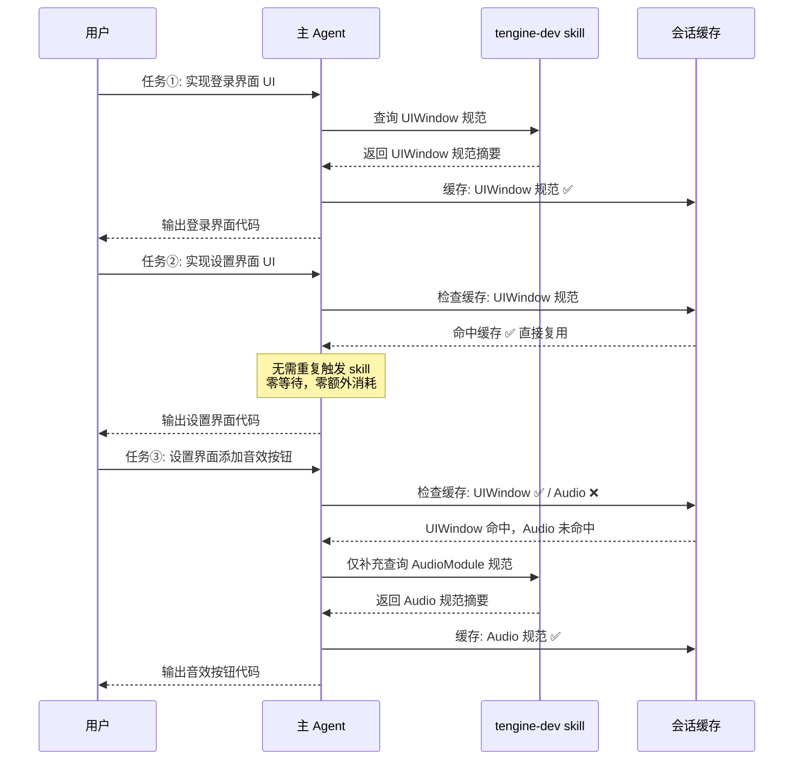
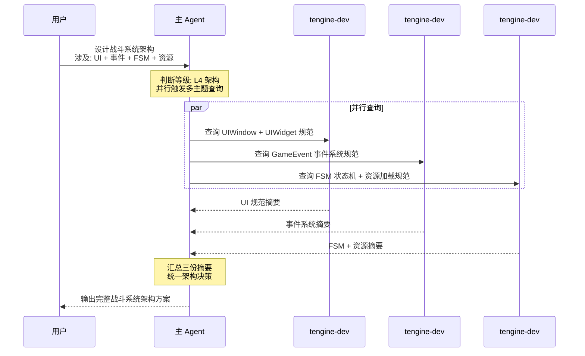
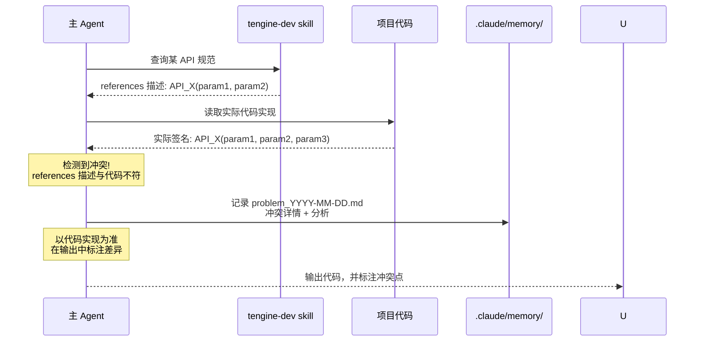

# TEngine

<div align="center">


**Unity 框架解决方案（社区修改版）**

[](https://unity3d.com/)
[](LICENSE)
[](https://github.com/typ77/TEngine)
[](https://github.com/typ77/TEngine/issues)
[](https://github.com/typ77/TEngine)
[](https://deepwiki.com/Alex-Rachel/TEngine)

</div>

---

## 🔄 二次修改说明

说实话，一开始没打算做这个开源项目。奈何 token 有点多，无所事事就让 AI 帮我做了一下 coding。又加上我对原项目略有点想法（你们先别管我理解得对不对，反正我就是这么想的），做了二次修改。

这个项目在我的工作项目中已有实践。为避免侵害公司权益，所有代码均由 AI 撰写，全程未使用原项目代码。我的角色是：**提出实现思路 → 最大限度的还原 → 做好 code review 和审核工作**。此乃本项目的初心。

继续 MIT 协议。不保证 100% 能同步官方版本。我的修改是因为我对此事的认识是这样，并不代表我的正确性，请各位看官见谅。

---

本项目 fork 自 [ALEXTANGXIAO/TEngine](https://github.com/ALEXTANGXIAO/TEngine)，保留原项目核心架构，新增和修改部分为独立实现。后续可能派生出独立项目。

**主要修改方向：**

| # | 方向 | 类型 | 一句话 |
|:-:|------|:----:|--------|
| 1 | Timer 模块重写 | 🔄 重写 | 线性遍历→最小堆，解决多定时器性能瓶颈 |
| 2 | UI 数据绑定 | 🆕 新增 | 手动 OnRefresh→响应式自动刷新，零外部依赖 |
| 3 | 框架质量加固 | 🔧 修复 | 事件异常隔离+资源泄漏防护+线程安全 |
| 4 | 测试体系 | 🆕 新增 | 102 个 EditMode 用例覆盖四大模块 |

📖 **详细说明**：[二次修改说明](Books/4-二次修改说明.md)

**现状**：✅ 完成，102 个 EditMode 用例

---

## 📖 简介

**TEngine** 是一个简单（新手友好、开箱即用）且强大的 Unity 框架全平台解决方案。对于需要一套上手快、文档清晰、高性能且可拓展性极强的商业级解决方案的开发者或团队来说，TEngine 是一个很好的选择。

### ✨ 核心特性

- 🚀 **开箱即用** - 5 分钟即可上手整套开发流程，代码整洁，思路清晰
- 🔥 **高性能** - 基于 UniTask 的异步系统，零 GC 事件分发，严格的内存管理
- 🧩 **高内聚低耦合** - 模块化设计，可轻松移除或替换不需要的模块
- 🔄 **热更新支持** - 集成 HybridCLR，全平台热更新流程已跑通
- 📦 **资源管理** - 集成 YooAsset，支持 LRU、ARC 缓存策略，自动资源释放
- 📊 **配置表系统** - 集成 Luban，支持懒加载、异步加载、同步加载
- 🎨 **UI 框架** - 商业化 UI 开发流程，支持代码自动生成 + 响应式数据绑定
- 🌍 **全平台支持** - Windows、Android、iOS、WebGL、微信小游戏等

---

## 📚 目录

- [快速开始](#-快速开始)
- [AI 开发工作流](#-ai-开发工作流)
- [文档导航](#-文档导航)
- [核心模块](#-核心模块)
- [项目结构](#-项目结构)
- [系统要求](#-系统要求)

---

## 🚀 快速开始

### 环境要求

- **Unity 版本**: 2021.3.20f1c1（推荐）或更高
- **支持版本**: Unity 2019.4 / 2020.3 / 2021.3 / 2022.3
- **开发环境**: .NET 4.x
- **支持平台**: Windows、OSX、Android、iOS、WebGL

### 快速上手

1. **克隆项目**
   ```bash
   git clone https://github.com/typ77/TEngine.git
   ```

2. **打开项目**
   - 使用 Unity 2021.3.20f1c1 打开项目

3. **编辑器模式运行**
   - 选择顶部栏目 `EditorMode` 编辑器下的模拟模式
   - 点击 `Launcher` 开始运行

4. **打包运行**（热更新流程）
   - 运行菜单 `HybridCLR/Install...` 安装 HybridCLR
   - 运行菜单 `HybridCLR/Define Symbols/Enable HybridCLR` 开启热更新
   - 运行菜单 `HybridCLR/Generate/All` 进行必要的生成操作
   - 运行菜单 `HybridCLR/Build/BuildAssets And CopyTo AssemblyPath` 生成热更新 DLL
   - 运行菜单 `YooAsset/AssetBundle Builder` 构建 AB
   - 打开 Build Settings，点击 Build And Run

> 💡 **提示**: 遇到问题请查看 [HybridCLR 常见错误](https://hybridclr.doc.code-philosophy.com/docs/help/commonerrors)

详细教程请参考：[快速开始指南](Books/1-快速开始.md)

---

## 🤖 AI 开发工作流

TEngine 深度集成了一套面向 Claude Code 的 AI 辅助开发工作流。通过 **tengine-dev skill 按需查询架构**、**任务等级分级触发**和**会话内缓存机制**，实现了规范驱动、高效的 AI 开发体验。

---

### 核心工具

| 工具 | 用途 |
|------|------|
| **tengine-dev** | Claude Code 专用 TEngine 开发技能，从 `references/` 提供全模块规范 |
| **Unity-MCP** | Unity Editor 自动化操作（场景、资源、脚本） |
| **openspec** | 规范驱动的变更管理 |
| **wiki-synchelper** | Wiki 文档同步助手（手动触发时使用） |

---

### 整体工作流总览



---

### 时序图一：规范获取流程

> **核心优势**：tengine-dev skill 直接从精炼的 `references/` 文档提取规范，无多余上下文噪声。



---

### 时序图二：会话内缓存机制

> **核心优势**：同一会话中相同主题只查询一次，后续任务直接复用，避免重复消耗。



---

### 时序图三：并行多主题查询（L4 架构任务）

> **核心优势**：架构级任务并行查询多个主题，汇总后统一决策，大幅减少串行等待。



---

### 时序图四：规范冲突处理

> **核心优势**：AI 主动检测 references 与代码的不一致，标注冲突并记录，以代码实现为最终依据。



---

### 工作流快速参考

```
┌─────────────────────────────────────────────────────────┐
│                   TEngine AI 工作流                      │
├─────────────────────────────────────────────────────────┤
│  Step 0  判断任务等级 L1/L2/L3/L4                        │
│  Step 1  L1 直接编码                                     │
│         L2-L4 触发 tengine-dev skill 获取规范            │
│         （会话内缓存命中则直接复用，无需重复触发）        │
│  Step 2  基于规范输出代码/方案                            │
│  Step 3  若规范与代码冲突，标注冲突，记录到 .claude/memory/│
└─────────────────────────────────────────────────────────┘
```

详细规范请参考：[CLAUDE.md](UnityProject/CLAUDE.md) | [AI 开发工作流指南](Books/AI-Development-Workflow.md)

---

## 📚 文档导航

### 基础文档

| 文档 | 描述 |
|------|------|
| [🔄 二次修改说明](Books/4-二次修改说明.md) | 本 fork 与官方版本的差异详解 |
| [📖 介绍](Books/0-介绍.md) | TEngine 框架介绍与核心特性 |
| [🏗️ 框架概览](Books/2-框架概览.md) | 框架架构与设计理念 |
| [🚀 快速开始](Books/1-快速开始.md) | 5 分钟快速上手教程 |
| [🌍 全平台运行](Books/99-各平台运行RunAble.md) | 各平台运行截图展示 |
| [🤖 AI 开发工作流](Books/AI-Development-Workflow.md) | openspec + tengine-dev AI 开发指南 |

### 核心模块文档

| 模块 | 文档 | 描述 |
|------|------|------|
| 📦 **资源模块** | [3-1-资源模块](Books/3-1-资源模块.md) | YooAsset 资源管理，支持 LRU/ARC 缓存 |
| 🎯 **事件模块** | [3-2-事件模块](Books/3-2-事件模块.md) | 零 GC 事件系统，支持 MVE 架构 |
| 💾 **内存池模块** | [3-3-内存池模块](Books/3-3-内存池模块.md) | 轻量级内存池管理 |
| 🎮 **对象池模块** | [3-4-对象池模块](Books/3-4-对象池模块.md) | 游戏对象池管理 |
| 🎨 **UI 模块** | [3-5-UI模块](Books/3-5-UI模块.md) | 商业化 UI 框架，支持代码生成 |
| 🔗 **UI 数据绑定** | [UI数据绑定](UnityProject/repowiki/zh/content/UI系统/UI数据绑定.md) | 响应式数据绑定系统（新增） |
| 📊 **配置表模块** | [3-6-配置表模块](Books/3-6-配置表模块.md) | Luban 配置表系统 |
| 🔄 **流程模块** | [3-7-流程模块](Books/3-7-流程模块.md) | 商业化启动流程 |
| 🌐 **网络模块** | [3-8-网络模块](Books/3-8-网络模块.md) | 网络通信模块 |

---

## 🧩 核心模块

### 资源模块 (ResourceModule)

- ✅ 基于 YooAsset 的资源管理系统
- ✅ 支持 EditorSimulateMode、OfflinePlayMode、HostPlayMode
- ✅ AssetReference 资源引用标识，自动管理资源生命周期
- ✅ AssetGroup 资源组管理
- ✅ LRU/ARC 缓存策略
- ✅ 同步/异步加载支持

### 事件模块 (GameEvent)

- ✅ 零 GC 事件系统
- ✅ 支持 string/int 事件 ID
- ✅ 支持 MVE（Model-View-Event）架构
- ✅ UI 生命周期自动绑定事件清理
- ✅ 单 handler 异常隔离，不影响后续 handler 执行（修改增强）

### UI 模块 (UIModule)

- ✅ 纯 C# 实现，脱离 Mono 生命周期
- ✅ 代码自动生成工具
- ✅ UIWindow/UIWidget 分层设计
- ✅ 支持全屏面板管理
- ✅ 事件驱动架构
- ✅ **响应式数据绑定** — BindableProperty + DataContext + 帧级批次合并（新增）
- ✅ **便捷绑定方法** — BindText / BindInteractable / BindToggle / BindSlider / BindSprite（新增）

### 配置表模块 (ConfigSystem)

- ✅ 集成 Luban 配置表解决方案
- ✅ 支持懒加载、异步加载、同步加载
- ✅ 强大的数据校验能力
- ✅ 完善的本地化支持

### 流程模块 (ProcedureModule)

完整的商业化启动流程：
- ProcedureLaunch → ProcedureSplash → ProcedureInitPackage
- ProcedurePreload → ProcedureInitResources
- ProcedureUpdateVersion → ProcedureUpdateManifest
- ProcedureCreateDownloader → ProcedureDownloadFile
- ProcedureDownloadOver → ProcedureClearCache
- ProcedureLoadAssembly → ProcedureStartGame

### 数据绑定模块 (DataBinding) 🆕

- ✅ BindableProperty\<T\> 响应式属性，赋值自动通知
- ✅ ObservableList\<T\> 响应式集合，增删改事件驱动
- ✅ BatchScheduler 帧级批次合并，同帧多次赋值合并为一次回调
- ✅ DataContext 多源聚合 + 格式转换，View 不直接依赖 Model
- ✅ MVE 四层架构：Model → Service → DataContext → View
- ✅ 零外部依赖，纯 C# 实现，与现有 OnRefresh / GameEvent 共存

---

## 📁 项目结构

```
Assets/
├── AssetArt/              # 美术资源目录
│   └── Atlas/            # 自动生成图集目录
├── AssetRaw/             # 热更资源目录
│   ├── UIRaw/            # UI 图片目录
│   │   ├── Atlas/        # 需要自动生成图集的 UI 素材目录
│   │   └── Raw/          # 不需要自动生成图集的 UI 素材目录
│   ├── Audios/           # 音频资源
│   ├── Effects/          # 特效资源
│   └── Scenes/           # 场景资源
├── Editor/               # 编辑器脚本目录
├── HybridCLRData/        # HybridCLR 相关目录
├── Scenes/               # 主场景目录
├── TEngine/              # 框架核心目录
│   ├── Editor/           # TEngine 编辑器核心代码
│   ├── Runtime/          # TEngine 运行时核心代码
│   ├── Tests/            # 单元测试目录 🆕
│   └── AssetSetting/     # YooAsset 资源设置
└── GameScripts/          # 程序集目录
    ├── Main/             # 主程序程序集（启动器与流程）
    └── HotFix/           # 游戏热更程序集目录
        ├── GameBase/     # 游戏基础框架程序集 [Dll]
        ├── GameProto/    # 游戏配置协议程序集 [Dll]
        └── GameLogic/    # 游戏业务逻辑程序集 [Dll]
            ├── GameApp.cs                  # 热更主入口
            ├── GameApp_RegisterSystem.cs   # 热更主入口注册系统
            ├── Module/DataBinding/         # 数据绑定模块 🆕
            └── UI/LoginUI/                 # MVE 四层架构示例 🆕
                ├── LoginModel.cs           # 纯数据层
                ├── LoginService.cs         # 业务操作层
                ├── LoginDataContext.cs     # 数据映射层
                └── LoginUI.cs              # 视图层
```

---

## 💻 系统要求

### Unity 版本

- **推荐版本**: Unity 2021.3.20f1c1
- **支持版本**: Unity 2019.4 / 2020.3 / 2021.3 / 2022.3

### 平台支持

- ✅ Windows (Standalone)
- ✅ macOS (Standalone)
- ✅ Android
- ✅ iOS
- ✅ WebGL
- ✅ 微信小游戏

### 开发环境

- .NET 4.x
- Visual Studio 2019+ 或 Rider

---

## 💡 为什么要使用 TEngine？

### 1. 开箱即用
- ✅ 5 分钟即可上手整套开发流程
- ✅ 代码整洁，思路清晰，功能强大
- ✅ 高内聚低耦合，可轻松移除或替换不需要的模块

### 2. 商业级解决方案
- ✅ 严格按照商业要求使用次世代的 **HybridCLR** 进行热更新
- ✅ 最佳的 **Luban** 配置表（支持懒加载、异步加载、同步加载）
- ✅ 百万 DAU 游戏验证过的 **YooAsset** 资源框架
- ✅ 全平台热更新流程已跑通

### 3. 严格的内存管理
- ✅ YooAsset 资源自动释放
- ✅ 支持 LRU、ARC 严格管理资源内存
- ✅ 防止内存泄漏

### 4. 商业化流程
- ✅ 商业化的热更新流程
- ✅ 商业化的 UI 开发流程
- ✅ 商业化的资源管理

### 5. 全平台验证
- ✅ 已有项目使用 TEngine 上架 **Steam**
- ✅ 已有项目使用 TEngine 上架 **微信小游戏**
- ✅ 已有项目使用 TEngine 上架 **App Store**

---

<div align="center">

**Fork of [TEngine](https://github.com/ALEXTANGXIAO/TEngine) · Made with 🤖 + ❤️**

[⭐ Star](https://github.com/typ77/TEngine) | [🐛 Issues](https://github.com/typ77/TEngine/issues) | [📖 Wiki](https://deepwiki.com/Alex-Rachel/TEngine)

</div>