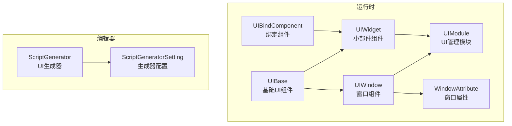
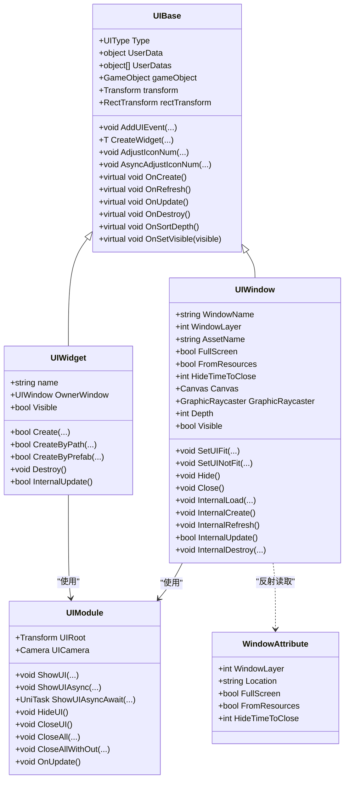
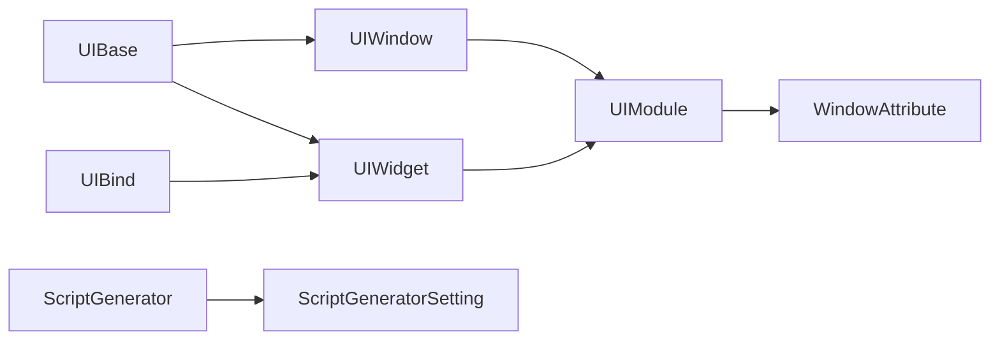

# UI系统API

<cite>
**本文档引用的文件**
- [UIBase.cs](file://Assets/GameScripts/HotFix/GameLogic/Module/UIModule/UIBase.cs)
- [UIWindow.cs](file://Assets/GameScripts/HotFix/GameLogic/Module/UIModule/UIWindow.cs)
- [UIWidget.cs](file://Assets/GameScripts/HotFix/GameLogic/Module/UIModule/UIWidget.cs)
- [UIModule.cs](file://Assets/GameScripts/HotFix/GameLogic/Module/UIModule/UIModule.cs)
- [WindowAttribute.cs](file://Assets/GameScripts/HotFix/GameLogic/Module/UIModule/WindowAttribute.cs)
- [ScriptGenerator.cs](file://Assets/Editor/UIScriptGenerator/ScriptGenerator.cs)
- [ScriptGeneratorSetting.cs](file://Assets/Editor/UIScriptGenerator/ScriptGeneratorSetting.cs)
- [UIBindComponent.cs](file://Assets/GameScripts/HotFix/GameLogic/Module/UIModule/UIBindComponent/UIBindComponent.cs)
</cite>

## 目录
1. [简介](#简介)
2. [项目结构](#项目结构)
3. [核心组件](#核心组件)
4. [架构总览](#架构总览)
5. [详细组件分析](#详细组件分析)
6. [依赖关系分析](#依赖关系分析)
7. [性能考虑](#性能考虑)
8. [故障排查指南](#故障排查指南)
9. [结论](#结论)
10. [附录](#附录)

## 简介
本文件为TEngine UI系统API的权威参考文档，覆盖UIBase基础组件、UIWindow窗口组件、UIWidget小部件组件以及ScriptGenerator UI生成器的完整API规范与使用方法。文档同时提供UI系统的开发流程、最佳实践与常见问题排查建议，帮助开发者高效构建稳定可靠的UI系统。

## 项目结构
TEngine UI系统主要位于GameLogic模块的UIModule中，包含基础UI组件、窗口管理、资源加载、脚本生成器等核心能力。编辑器侧提供ScriptGenerator工具，辅助快速生成UI组件绑定与事件代码。

图表来源
- [UIBase.cs:18-608](file://Assets/GameScripts/HotFix/GameLogic/Module/UIModule/UIBase.cs#L18-L608)
- [UIWindow.cs:11-538](file://Assets/GameScripts/HotFix/GameLogic/Module/UIModule/UIWindow.cs#L11-L538)
- [UIWidget.cs:7-315](file://Assets/GameScripts/HotFix/GameLogic/Module/UIModule/UIWidget.cs#L7-L315)
- [UIModule.cs:15-759](file://Assets/GameScripts/HotFix/GameLogic/Module/UIModule/UIModule.cs#L15-L759)
- [WindowAttribute.cs:5-78](file://Assets/GameScripts/HotFix/GameLogic/Module/UIModule/WindowAttribute.cs#L5-L78)
- [ScriptGenerator.cs:8-343](file://Assets/Editor/UIScriptGenerator/ScriptGenerator.cs#L8-L343)
- [ScriptGeneratorSetting.cs:10-207](file://Assets/Editor/UIScriptGenerator/ScriptGeneratorSetting.cs#L10-L207)
- [UIBindComponent.cs:17-39](file://Assets/GameScripts/HotFix/GameLogic/Module/UIModule/UIBindComponent/UIBindComponent.cs#L17-L39)

章节来源
- [UIModule.cs:15-114](file://Assets/GameScripts/HotFix/GameLogic/Module/UIModule/UIModule.cs#L15-L114)

## 核心组件
- UIBase：所有UI组件的抽象基类，提供生命周期钩子、事件系统、查找子组件、创建Widget、层级排序等通用能力。
- UIWindow：窗口级UI，负责资源加载、Canvas与GraphicRaycaster管理、可见性与交互性控制、层级排序、刘海屏适配等。
- UIWidget：窗口内的小部件组件，负责自身生命周期、父子关系维护、可见性控制、Canvas层级继承等。
- UIModule：UI管理器，负责窗口栈管理、窗口打开/关闭/隐藏、层级排序、可见性计算、资源加载等。
- WindowAttribute：窗口类的元数据属性，声明窗口层级、资源定位、全屏标记、隐藏后自动关闭等。
- ScriptGenerator：编辑器工具，根据UI树自动生成组件绑定与事件代码，并支持UniTask版本。
- ScriptGeneratorSetting：生成器配置，定义命名空间、代码风格、组件规则、生成路径等。
- UIBindComponent：运行时绑定组件，用于存储与索引预设的组件集合，便于按索引获取。

章节来源
- [UIBase.cs:18-608](file://Assets/GameScripts/HotFix/GameLogic/Module/UIModule/UIBase.cs#L18-L608)
- [UIWindow.cs:11-538](file://Assets/GameScripts/HotFix/GameLogic/Module/UIModule/UIWindow.cs#L11-L538)
- [UIWidget.cs:7-315](file://Assets/GameScripts/HotFix/GameLogic/Module/UIModule/UIWidget.cs#L7-L315)
- [UIModule.cs:15-759](file://Assets/GameScripts/HotFix/GameLogic/Module/UIModule/UIModule.cs#L15-L759)
- [WindowAttribute.cs:5-78](file://Assets/GameScripts/HotFix/GameLogic/Module/UIModule/WindowAttribute.cs#L5-L78)
- [ScriptGenerator.cs:8-343](file://Assets/Editor/UIScriptGenerator/ScriptGenerator.cs#L8-L343)
- [ScriptGeneratorSetting.cs:10-207](file://Assets/Editor/UIScriptGenerator/ScriptGeneratorSetting.cs#L10-L207)
- [UIBindComponent.cs:17-39](file://Assets/GameScripts/HotFix/GameLogic/Module/UIModule/UIBindComponent/UIBindComponent.cs#L17-L39)

## 架构总览
UI系统采用“模块化+分层”的设计：UIModule作为顶层协调者，管理窗口栈与层级；UIWindow负责窗口生命周期与渲染；UIWidget负责子组件生命周期与可见性；UIBase提供统一的生命周期与事件机制；WindowAttribute提供窗口元数据；ScriptGenerator提供代码生成能力。

图表来源
- [UIBase.cs:18-608](file://Assets/GameScripts/HotFix/GameLogic/Module/UIModule/UIBase.cs#L18-L608)
- [UIWindow.cs:11-538](file://Assets/GameScripts/HotFix/GameLogic/Module/UIModule/UIWindow.cs#L11-L538)
- [UIWidget.cs:7-315](file://Assets/GameScripts/HotFix/GameLogic/Module/UIModule/UIWidget.cs#L7-L315)
- [UIModule.cs:15-759](file://Assets/GameScripts/HotFix/GameLogic/Module/UIModule/UIModule.cs#L15-L759)
- [WindowAttribute.cs:20-77](file://Assets/GameScripts/HotFix/GameLogic/Module/UIModule/WindowAttribute.cs#L20-L77)

## 详细组件分析

### UIBase 基础UI组件API
- 生命周期
  - OnCreate：窗口创建时调用，进行初始化。
  - OnRefresh：窗口准备完成后调用，进行数据刷新。
  - OnUpdate：每帧更新入口，返回是否继续参与更新。
  - OnDestroy：销毁时调用，清理资源。
  - OnSortDepth：层级排序时触发，子组件同步排序。
  - OnSetVisible：可见性变化时触发。
- 事件系统
  - AddUIEvent：添加UI事件监听，支持多重重载。
  - RemoveAllUIEvent：移除所有UI事件。
- 组件查找与绑定
  - FindChild/FindChildComponent：按路径查找子节点或组件。
  - ScriptGenerator/BindMemberProperty/RegisterEvent：代码生成与绑定、事件注册钩子。
- Widget管理
  - CreateWidget系列：通过路径、父节点、预制体等方式创建Widget。
  - AdjustIconNum/AsyncAdjustIconNum：动态调整图标数量，支持异步批处理。
- 数据与层级
  - UserData/UserDatas：自定义数据传入。
  - _isSortingOrderDirty/SetUpdateDirty：层级排序脏标记与更新脏标记。

章节来源
- [UIBase.cs:18-608](file://Assets/GameScripts/HotFix/GameLogic/Module/UIModule/UIBase.cs#L18-L608)

### UIWindow 窗口组件API
- 属性
  - WindowName/WindowLayer/AssetName：窗口标识与资源定位。
  - FullScreen/FromResources/HideTimeToClose：全屏、资源来源、隐藏后自动关闭。
  - Canvas/GraphicRaycaster：Canvas与射线检测组件。
  - Depth：窗口Canvas排序层级。
  - Visible：可见性控制，同时控制交互性与层级。
  - **LoadFailed**：加载失败标志（`internal bool LoadFailed { get; }`），当资源加载异常时由 UIModule 设置为 `true`，异步等待方法（ShowUIAsyncAwait、GetUIAsyncAwait、GetUIAsync）检测到此标志后立即返回 `null`，避免无限等待僵尸窗口。
- 生命周期
  - InternalLoad/InternalCreate/InternalRefresh/InternalUpdate/InternalDestroy：内部生命周期编排。
  - Hide/Close：隐藏与关闭窗口。
  - CancelHideToCloseTimer：取消隐藏后自动关闭计时器。
- 适配
  - SetUIFit/SetUINotFit：刘海屏适配与排除适配区域。

章节来源
- [UIWindow.cs:11-538](file://Assets/GameScripts/HotFix/GameLogic/Module/UIModule/UIWindow.cs#L11-L538)

### UIWidget 小部件组件API
- 属性
  - name：组件名称。
  - OwnerWindow：所属窗口。
  - Visible：组件可见性，同时触发OnSetVisible。
- 生命周期
  - Create/CreateByPath/CreateByPrefab：三种创建方式。
  - InternalUpdate：内部每帧更新逻辑。
  - Destroy：主动销毁组件。
- Canvas层级
  - RestChildCanvas：继承父Canvas排序层级。

章节来源
- [UIWidget.cs:7-315](file://Assets/GameScripts/HotFix/GameLogic/Module/UIModule/UIWidget.cs#L7-L315)

### UIModule UI管理器API
- 窗口管理
  - ShowUI/ShowUIAsync/ShowUIAsyncAwait：打开窗口（同步/异步/等待）。
  - HideUI/CloseUI/CloseAll/CloseAllWithOut：隐藏、关闭、全部关闭、保留特定窗口。
  - GetUIAsyncAwait/GetUIAsync：异步获取已存在的窗口实例，支持 LoadFailed 检测与超时返回 `null`。
- 实例属性（通过 `UIModule.Instance` 访问）
  - **UIRoot**：UI 根节点 Transform（实例属性，非静态字段）。
  - **Resource**：资源加载器 `IUIResourceLoader`（实例字段，非静态字段）。UIBase/UIWindow/UIWidget 内部统一通过 `UIModule.Instance.Resource` 加载资源。
- 可见性与层级
  - OnSortWindowDepth：按层级重排窗口Depth。
  - OnSetWindowVisible：自顶向下设置可见性，处理全屏遮挡。
- 常量
  - LAYER_DEEP/WINDOW_DEEP/WINDOW_HIDE_LAYER/WINDOW_SHOW_LAYER：层级与层位常量。

章节来源
- [UIModule.cs:15-759](file://Assets/GameScripts/HotFix/GameLogic/Module/UIModule/UIModule.cs#L15-L759)

### WindowAttribute 窗口属性API
- WindowLayer：窗口层级（Bottom/UI/Top/Tips/System）。
- Location：资源定位地址。
- FullScreen：是否全屏窗口。
- FromResources：是否来自Resources而非AB。
- HideTimeToClose：隐藏后自动关闭延迟。

章节来源
- [WindowAttribute.cs:5-78](file://Assets/GameScripts/HotFix/GameLogic/Module/UIModule/WindowAttribute.cs#L5-L78)

### ScriptGenerator UI生成器API
- 菜单入口
  - UIProperty/UIProperty - UniTask：生成变量与绑定代码。
  - UIPropertyAndListener/UIPropertyAndListener - UniTask：生成变量、绑定与事件回调。
- 生成逻辑
  - Generate/Ergodic/WriteScript：遍历UI树，生成字段、绑定与事件回调。
  - GetRelativePath/GetBtnFuncName/GetToggleFuncName等：路径与回调命名规则。
- 配置
  - ScriptGeneratorSetting：命名空间、代码风格、组件规则、生成路径、UI类型等。

章节来源
- [ScriptGenerator.cs:8-343](file://Assets/Editor/UIScriptGenerator/ScriptGenerator.cs#L8-L343)
- [ScriptGeneratorSetting.cs:10-207](file://Assets/Editor/UIScriptGenerator/ScriptGeneratorSetting.cs#L10-L207)

### UIBindComponent 运行时绑定API
- GetComponent<T>(index)：按索引获取存储的组件，带越界与类型检查。

章节来源
- [UIBindComponent.cs:17-39](file://Assets/GameScripts/HotFix/GameLogic/Module/UIModule/UIBindComponent/UIBindComponent.cs#L17-L39)

## 依赖关系分析
- UIBase为UI体系的抽象基类，UIWindow与UIWidget均继承自它，统一了生命周期与事件机制。
- UIWindow与UIWidget通过UIModule进行资源加载与层级管理，UIModule维护窗口栈并计算可见性。
- WindowAttribute通过反射在UIModule创建窗口实例时读取，决定窗口的资源定位与层级。
- ScriptGenerator与ScriptGeneratorSetting配合，为UI开发提供代码生成与配置化支持。
- UIBindComponent为运行时绑定提供索引访问能力，减少运行时查找成本。

图表来源
- [UIBase.cs:18-608](file://Assets/GameScripts/HotFix/GameLogic/Module/UIModule/UIBase.cs#L18-L608)
- [UIWindow.cs:11-538](file://Assets/GameScripts/HotFix/GameLogic/Module/UIModule/UIWindow.cs#L11-L538)
- [UIWidget.cs:7-315](file://Assets/GameScripts/HotFix/GameLogic/Module/UIModule/UIWidget.cs#L7-L315)
- [UIModule.cs:15-759](file://Assets/GameScripts/HotFix/GameLogic/Module/UIModule/UIModule.cs#L15-L759)
- [WindowAttribute.cs:20-77](file://Assets/GameScripts/HotFix/GameLogic/Module/UIModule/WindowAttribute.cs#L20-L77)
- [ScriptGenerator.cs:8-343](file://Assets/Editor/UIScriptGenerator/ScriptGenerator.cs#L8-L343)
- [ScriptGeneratorSetting.cs:10-207](file://Assets/Editor/UIScriptGenerator/ScriptGeneratorSetting.cs#L10-L207)
- [UIBindComponent.cs:17-39](file://Assets/GameScripts/HotFix/GameLogic/Module/UIModule/UIBindComponent/UIBindComponent.cs#L17-L39)

## 性能考虑
- 更新链路优化
  - UIBase/UIWidget维护_updateListValid与_updateList，避免每帧重建更新列表，仅在脏标记时重建。
  - UIWindow在可见且准备就绪时才参与更新，减少无效开销。
- 资源加载
  - 支持异步加载资源，避免阻塞主线程；资源加载完成后统一进入准备阶段。
- 层级排序
  - 使用深度增量策略，按层级批量设置sortingOrder，减少多次排序带来的开销。
- 组件复用
  - AdjustIconNum与AsyncAdjustIconNum支持动态增删，结合异步yield实现帧切分，降低卡顿风险。

章节来源
- [UIBase.cs:121-139](file://Assets/GameScripts/HotFix/GameLogic/Module/UIModule/UIBase.cs#L121-L139)
- [UIWindow.cs:356-425](file://Assets/GameScripts/HotFix/GameLogic/Module/UIModule/UIWindow.cs#L356-L425)
- [UIWidget.cs:71-140](file://Assets/GameScripts/HotFix/GameLogic/Module/UIModule/UIWidget.cs#L71-L140)
- [UIModule.cs:480-516](file://Assets/GameScripts/HotFix/GameLogic/Module/UIModule/UIModule.cs#L480-L516)

## 故障排查指南
- 窗口未显示
  - 检查Visible属性与层级排序，确认是否被全屏窗口遮挡。
  - 确认UIModule.OnSetWindowVisible执行顺序与FullScreen标记。
- 资源加载失败
  - 检查AssetName与FromResources设置，确保资源路径正确。
  - 异步加载时关注IsLoadDone状态与超时处理。
  - 若 `LoadFailed` 为 `true`，说明资源加载过程中发生异常，异步方法会返回 `null`；检查资源路径与资源包完整性。
- 事件未触发
  - 确认AddUIEvent注册时机与事件类型一致性。
  - 检查UIWidget/UIWindow的OnCreate/OnRefresh是否正确调用。
- 生成器无法使用
  - 确认ScriptGeneratorSetting存在且配置正确。
  - 若启用UIBindComponent模式，部分菜单项会禁用。

章节来源
- [UIWindow.cs:143-188](file://Assets/GameScripts/HotFix/GameLogic/Module/UIModule/UIWindow.cs#L143-L188)
- [UIModule.cs:493-516](file://Assets/GameScripts/HotFix/GameLogic/Module/UIModule/UIModule.cs#L493-L516)
- [ScriptGenerator.cs:12-58](file://Assets/Editor/UIScriptGenerator/ScriptGenerator.cs#L12-L58)
- [ScriptGeneratorSetting.cs:100-115](file://Assets/Editor/UIScriptGenerator/ScriptGeneratorSetting.cs#L100-L115)

## 结论
TEngine UI系统通过清晰的分层与模块化设计，提供了完整的窗口与小部件生命周期管理、层级与可见性控制、资源加载与代码生成能力。遵循本文档的API规范与最佳实践，可显著提升UI开发效率与系统稳定性。

## 附录

### 开发流程与最佳实践
- 设计阶段
  - 使用WindowAttribute标注窗口层级、资源定位与全屏标记。
  - 使用ScriptGeneratorSetting配置命名空间、代码风格与组件规则。
- 编辑阶段
  - 使用ScriptGenerator生成UI绑定与事件代码，减少手写错误。
  - 如需运行时绑定，使用UIBindComponent存储组件索引。
- 运行阶段
  - 通过UIModule打开/隐藏/关闭窗口，利用异步接口避免阻塞。
  - 在UIWindow/UIWidget中实现业务逻辑，遵循生命周期钩子。
  - 使用AdjustIconNum/AsyncAdjustIconNum动态管理大量子组件。

章节来源
- [WindowAttribute.cs:20-77](file://Assets/GameScripts/HotFix/GameLogic/Module/UIModule/WindowAttribute.cs#L20-L77)
- [ScriptGeneratorSetting.cs:10-207](file://Assets/Editor/UIScriptGenerator/ScriptGeneratorSetting.cs#L10-L207)
- [ScriptGenerator.cs:8-343](file://Assets/Editor/UIScriptGenerator/ScriptGenerator.cs#L8-L343)
- [UIModule.cs:246-478](file://Assets/GameScripts/HotFix/GameLogic/Module/UIModule/UIModule.cs#L246-L478)