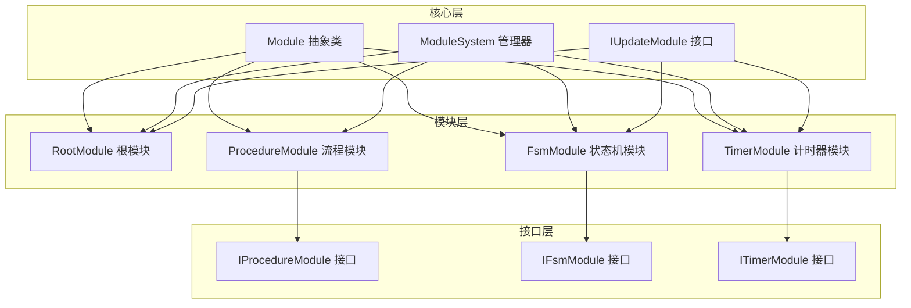
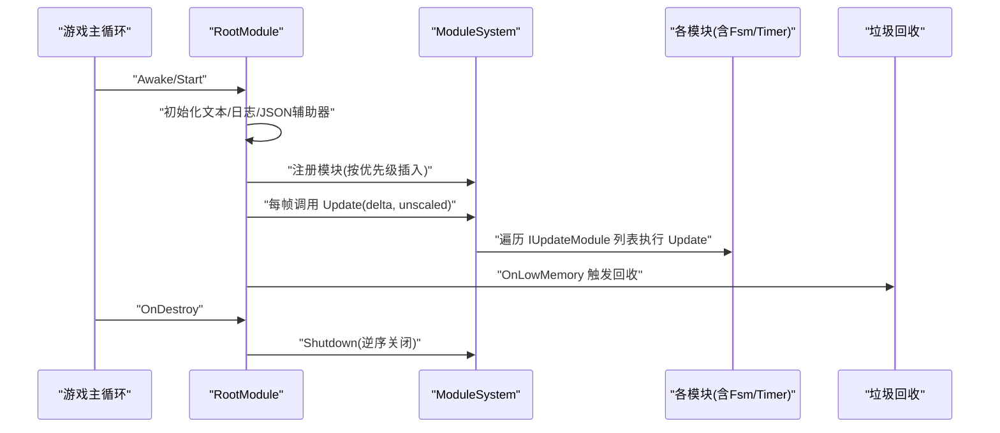
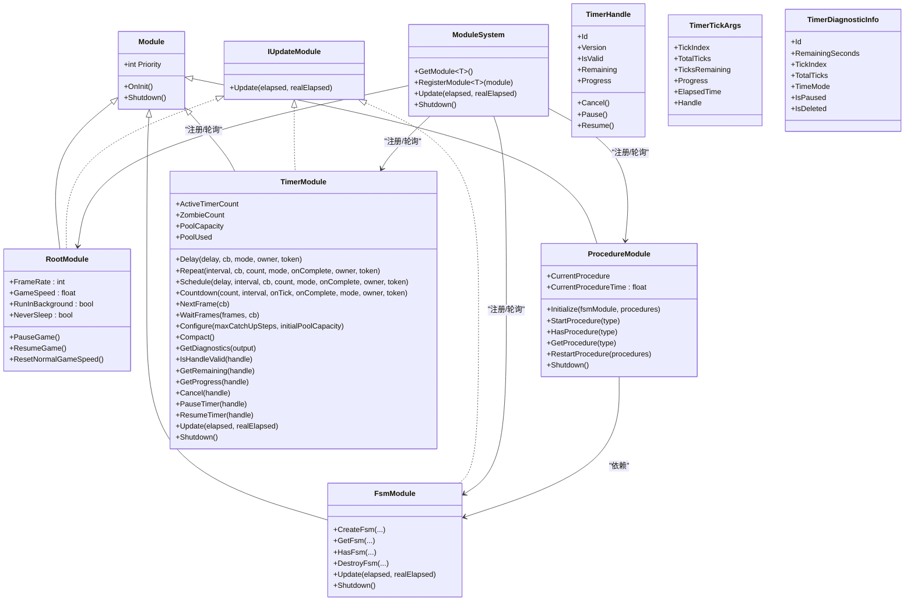

# 模块系统API

<cite>
**本文引用的文件**
- [Module.cs](file://Assets/TEngine/Runtime/Core/Module.cs)
- [ModuleSystem.cs](file://Assets/TEngine/Runtime/Core/ModuleSystem.cs)
- [RootModule.cs](file://Assets/TEngine/Runtime/Module/RootModule.cs)
- [ProcedureModule.cs](file://Assets/TEngine/Runtime/Module/ProcedureModule/ProcedureModule.cs)
- [IProcedureModule.cs](file://Assets/TEngine/Runtime/Module/ProcedureModule/IProcedureModule.cs)
- [ProcedureBase.cs](file://Assets/TEngine/Runtime/Module/ProcedureModule/ProcedureBase.cs)
- [FsmModule.cs](file://Assets/TEngine/Runtime/Module/FsmModule/FsmModule.cs)
- [IFsmModule.cs](file://Assets/TEngine/Runtime/Module/FsmModule/IFsmModule.cs)
- [TimerModule.cs](file://Assets/TEngine/Runtime/Module/TimerModule/TimerModule.cs)
- [ITimerModule.cs](file://Assets/TEngine/Runtime/Module/TimerModule/ITimerModule.cs)
- [TimerTypes.cs](file://Assets/TEngine/Runtime/Module/TimerModule/TimerTypes.cs)
- [TimerNode.cs](file://Assets/TEngine/Runtime/Module/TimerModule/TimerNode.cs)
- [TimerNodePool.cs](file://Assets/TEngine/Runtime/Module/TimerModule/TimerNodePool.cs)
- [IndexedMinHeap.cs](file://Assets/TEngine/Runtime/Module/TimerModule/IndexedMinHeap.cs)
</cite>

## 目录
1. [简介](#简介)
2. [项目结构](#项目结构)
3. [核心组件](#核心组件)
4. [架构总览](#架构总览)
5. [详细组件分析](#详细组件分析)
6. [依赖关系分析](#依赖关系分析)
7. [性能考虑](#性能考虑)
8. [故障排查指南](#故障排查指南)
9. [结论](#结论)
10. [附录](#附录)

## 简介
本文件为 TEngine 模块系统API的权威参考，覆盖以下模块：
- RootModule 根模块：负责全局初始化、帧驱动、全局设置（帧率、时间缩放、后台运行、休眠策略）、日志/文本/JSON辅助器注入、低内存回收等。
- ProcedureModule 流程模块：基于有限状态机的流程管理器，提供流程生命周期管理、状态切换、流程查询与重启等能力。
- FsmModule 状态机模块：通用有限状态机管理器，支持多持有者、多命名状态机，提供创建、查询、销毁与更新调度。
- TimerModule 计时器模块：统一计时器调度，支持循环/一次性、逻辑时间/真实时间两种模式，提供暂停/恢复/重置/移除等。

## 项目结构
模块系统采用“接口+实现”的分层设计，核心抽象位于 Core 层，模块实现位于 Module 子目录，各模块通过 ModuleSystem 统一注册、排序与轮询。

图示来源
- [Module.cs:22-39](file://Assets/TEngine/Runtime/Core/Module.cs#L22-L39)
- [ModuleSystem.cs:9-208](file://Assets/TEngine/Runtime/Core/ModuleSystem.cs#L9-L208)
- [RootModule.cs:10-304](file://Assets/TEngine/Runtime/Module/RootModule.cs#L10-L304)
- [ProcedureModule.cs:8-209](file://Assets/TEngine/Runtime/Module/ProcedureModule/ProcedureModule.cs#L8-L209)
- [FsmModule.cs:9-396](file://Assets/TEngine/Runtime/Module/FsmModule/FsmModule.cs#L9-L396)
- [TimerModule.cs:8-478](file://Assets/TEngine/Runtime/Module/TimerModule/TimerModule.cs#L8-L478)

章节来源
- [Module.cs:1-40](file://Assets/TEngine/Runtime/Core/Module.cs#L1-L40)
- [ModuleSystem.cs:1-208](file://Assets/TEngine/Runtime/Core/ModuleSystem.cs#L1-L208)

## 核心组件
- 模块抽象与轮询接口
  - Module：定义优先级、OnInit、Shutdown 抽象方法。
  - IUpdateModule：定义 Update(elapsed, realElapsed) 轮询接口。
- 模块系统
  - ModuleSystem：集中注册、排序、构建执行列表、统一 Update、统一 Shutdown。
  - 支持按接口类型获取模块、按类型创建模块、手动注册自定义模块实例。

章节来源
- [Module.cs:8-39](file://Assets/TEngine/Runtime/Core/Module.cs#L8-L39)
- [ModuleSystem.cs:9-208](file://Assets/TEngine/Runtime/Core/ModuleSystem.cs#L9-L208)

## 架构总览
模块系统以 RootModule 为入口，贯穿初始化、帧驱动、模块注册与轮询、资源回收与关闭。

图示来源
- [RootModule.cs:116-167](file://Assets/TEngine/Runtime/Module/RootModule.cs#L116-L167)
- [ModuleSystem.cs:29-60](file://Assets/TEngine/Runtime/Core/ModuleSystem.cs#L29-L60)
- [ModuleSystem.cs:143-194](file://Assets/TEngine/Runtime/Core/ModuleSystem.cs#L143-L194)

## 详细组件分析

### RootModule 根模块 API
- 全局设置
  - 帧率：可读写，内部同步到 Application.targetFrameRate。
  - 游戏速度：可读写，内部同步到 Time.timeScale；提供 IsGamePaused、IsNormalGameSpeed 辅助判断。
  - 后台运行：可读写，同步到 Application.runInBackground。
  - 禁止休眠：可读写，根据值设置 Screen.sleepTimeout。
  - 编辑器语言：可读写（编辑器内有效）。
  - 文本/日志/JSON辅助器：通过类型名反射创建并注入。
- 生命周期与帧驱动
  - Awake：初始化辅助器、设置帧率/时间缩放/后台运行/休眠策略、注册低内存回调、启动 GameTime。
  - Update/FixedUpdate/LateUpdate：推进 GameTime 并调用 ModuleSystem.Update。
  - OnDestroy：在非编辑器环境调用 ModuleSystem.Shutdown。
  - OnApplicationQuit：注销低内存回调并停止协程。
- 低内存处理
  - 触发时尝试释放对象池未使用对象与资源模块缓存。
- 帧驱动与模块轮询
  - 每帧向 ModuleSystem 传递逻辑时间与真实时间，由其统一调度 IUpdateModule。

最佳实践
- 在 Awake 阶段完成辅助器与全局设置，确保模块初始化前可用。
- 使用 GameSpeed 控制全局节奏，配合 IsGamePaused 判断暂停状态。
- 将耗时任务拆分为多帧执行，避免单帧卡顿。

章节来源
- [RootModule.cs:30-111](file://Assets/TEngine/Runtime/Module/RootModule.cs#L30-L111)
- [RootModule.cs:116-167](file://Assets/TEngine/Runtime/Module/RootModule.cs#L116-L167)
- [RootModule.cs:287-302](file://Assets/TEngine/Runtime/Module/RootModule.cs#L287-L302)

### ProcedureModule 流程模块 API
- 模块特性
  - 优先级较低（-2），确保在其他模块之后轮询。
  - 内部持有 IFsmModule 与 IFsm<IProcedureModule>。
- 关键接口
  - Initialize：绑定 IFsmModule 并创建流程状态机，传入若干流程。
  - StartProcedure：按泛型或类型启动指定流程。
  - HasProcedure/GetProcedure：查询与获取流程实例。
  - CurrentProcedure/CurrentProcedureTime：获取当前流程及其已持续时间。
  - RestartProcedure：销毁旧状态机并用新流程集重建，随后启动首个流程。
  - Shutdown：销毁流程状态机并释放引用。
- 与 FsmModule 的协作
  - 通过 IFsmModule.CreateFsm 创建流程状态机，流程本身继承 FsmState<IProcedureModule>。

最佳实践
- 在应用启动阶段调用 Initialize 并立即 StartProcedure 启动首个流程。
- 使用 CurrentProcedureTime 记录流程阶段耗时，便于统计与调试。
- RestartProcedure 用于热更新或流程重置场景，需保证新流程集合有效。

章节来源
- [ProcedureModule.cs:8-209](file://Assets/TEngine/Runtime/Module/ProcedureModule/ProcedureModule.cs#L8-L209)
- [IProcedureModule.cs:8-83](file://Assets/TEngine/Runtime/Module/ProcedureModule/IProcedureModule.cs#L8-L83)
- [ProcedureBase.cs:8-59](file://Assets/TEngine/Runtime/Module/ProcedureModule/ProcedureBase.cs#L8-L59)

### FsmModule 状态机模块 API
- 模块特性
  - 优先级较高（1），确保在模块轮询早期更新。
  - 实现 IUpdateModule，对所有状态机进行统一 Update。
- 查询与统计
  - Count：返回状态机数量。
  - HasFsm：按持有者类型或（持有者类型+名称）查询是否存在状态机。
  - GetFsm：按持有者类型或（持有者类型+名称）获取状态机实例。
  - GetAllFsms：获取全部状态机数组或追加到结果列表。
- 创建与销毁
  - CreateFsm：支持无名/有名、集合/列表两种形式创建状态机。
  - DestroyFsm：支持按持有者类型/名称/实例销毁，返回是否成功。
- 更新调度
  - Update：遍历临时列表对未销毁状态机执行 Update，避免并发修改。

最佳实践
- 为复杂业务创建独立命名的状态机，便于隔离与调试。
- 在模块 Shutdown 中显式销毁状态机，避免残留引用。
- 对频繁创建销毁的状态机，考虑池化或延迟销毁策略。

章节来源
- [FsmModule.cs:9-396](file://Assets/TEngine/Runtime/Module/FsmModule/FsmModule.cs#L9-L396)
- [IFsmModule.cs:9-175](file://Assets/TEngine/Runtime/Module/FsmModule/IFsmModule.cs#L9-L175)

### TimerModule 计时器模块 API（重构版 v2.0）

- **模块特性**
  - 基于双堆结构的高性能定时器系统，分别维护逻辑时间和真实时间的定时器队列
  - 使用对象池预分配 TimerNode，实现零 GC 创建
  - TimerHandle 结构体替代整数 ID，通过版本号防止无效引用访问
  - 支持完整的游戏定时语义：暂停/恢复、Owner 绑定、CancellationToken 取消
  - 提供完整的诊断系统：活跃定时器数量、Zombie 定时器、对象池状态等

- **核心类型**
  - `TimeMode` 枚举：`Scaled`（受时间缩放影响）、`Unscaled`（不受时间缩放影响）
  - `TimerHandle` 结构体：定时器句柄，包含 Id 和版本号，提供 IsValid/Remaining/Progress 属性和 Cancel/Pause/Resume 方法
  - `TimerTickArgs` 结构体：回调参数，包含 TickIndex、TotalTicks、TicksRemaining、Progress、ElapsedTime、Handle
  - `TimerDiagnosticInfo` 结构体：诊断信息，包含 Id、RemainingSeconds、TickIndex、TotalTicks、TimeMode、IsPaused、IsDeleted

- **定时器创建 API**
  - `Delay`：创建延迟定时器，支持两种回调签名（Action/Action<TimerTickArgs>）
  - `Repeat`：创建循环定时器，支持指定次数或无限循环（-1）
  - `Schedule`：创建调度定时器（延迟 + 循环），提供最灵活的控制
  - `Countdown`：创建倒计时定时器，语义糖用于倒计时场景
  - `NextFrame`：下一帧触发
  - `WaitFrames`：等待指定帧数后触发

- **定时器控制 API（通过 TimerHandle）**
  - `Cancel`：取消定时器，惰性删除（标记 IsDeleted=true）
  - `Pause`：暂停定时器，通过 ChangeKey 移至堆底
  - `Resume`：恢复定时器，重新计算触发时间并移回堆顶
  - `IsValid`：查询定时器是否有效（版本号匹配且未删除）
  - `Remaining`：查询剩余时间
  - `Progress`：查询进度（0~1，循环定时器为 NaN）

- **系统配置与诊断**
  - `Configure`：配置定时器系统参数（maxCatchUpSteps、initialPoolCapacity）
  - `Compact`：清理已取消的定时器，重建堆结构
  - `ActiveTimerCount`：活跃定时器数量
  - `ZombieCount`：已取消但未清理的定时器数量
  - `PoolCapacity`：对象池容量
  - `PoolUsed`：对象池已使用数
  - `GetDiagnostics`：获取定时器诊断信息列表

- **向后兼容（Obsolete API）**
  - `AddTimer`：旧版添加定时器 API，内部转换为 Delay/Repeat
  - `RemoveTimer/RemoveAllTimer`：移除定时器，内部调用 TimerHandle.Cancel()
  - `Stop/Resume`：暂停/恢复定时器，内部调用 TimerHandle.Pause/Resume()
  - `IsRunning/GetLeftTime`：查询状态，内部转换为 TimerHandle.IsValid/Remaining
  - `Restart/ResetTimer`：重置定时器，新推荐使用 Schedule
  - `AddSystemTimer`：系统级定时器，推荐使用 UniTask.Delay

- **内部机制**
  - 双堆调度：`IndexedMinHeap` 分别管理 Scaled 和 Unscaled 定时器，O(1) 空帧检测，O(log n) 插入/删除
  - 对象池管理：`TimerNodePool` 预分配数组 + FreeStack，支持自动扩容和版本管理
  - 惰性删除：Cancel 仅标记 IsDeleted，在堆弹出时回收节点
  - 追赶逻辑：当帧间隔过大时，按 MaxCatchUpSteps 限制触发次数，避免卡顿时的异常行为
  - 帧队列：NextFrame/WaitFrames 使用独立的 List<FrameTimerNode>，不进入时间堆
  - 安全机制：Owner 销毁自动取消、CancellationToken 支持、回调异常隔离

**最佳实践**
- 使用 TimerHandle 替代整数 ID，利用版本号机制避免无效引用访问
- 优先使用 TimerTickArgs 回调获取进度信息，避免手动计算
- 对 UI/动画等对时间缩放敏感的逻辑使用 TimeMode.Scaled（默认）
- 对调试/统计等不受影响的逻辑使用 TimeMode.Unscaled
- 为需要自动清理的定时器绑定 Owner，确保对象销毁时定时器取消
- 定期调用 Compact() 清理 Zombie 定时器，降低内存占用
- 使用 Configure() 调整 MaxCatchUpSteps 和初始池容量以适应项目需求
- 避免创建大量短周期循环定时器，必要时合并或降频

章节来源
- [TimerModule.cs:8-478](file://Assets/TEngine/Runtime/Module/TimerModule/TimerModule.cs#L8-L478)
- [ITimerModule.cs:3-66](file://Assets/TEngine/Runtime/Module/TimerModule/ITimerModule.cs#L3-L66)

## 依赖关系分析
模块间依赖关系如下：

图示来源
- [Module.cs:22-39](file://Assets/TEngine/Runtime/Core/Module.cs#L22-L39)
- [ModuleSystem.cs:9-208](file://Assets/TEngine/Runtime/Core/ModuleSystem.cs#L9-L208)
- [RootModule.cs:10-304](file://Assets/TEngine/Runtime/Module/RootModule.cs#L10-L304)
- [ProcedureModule.cs:8-209](file://Assets/TEngine/Runtime/Module/ProcedureModule/ProcedureModule.cs#L8-L209)
- [FsmModule.cs:9-396](file://Assets/TEngine/Runtime/Module/FsmModule/FsmModule.cs#L9-L396)
- [TimerModule.cs:8-478](file://Assets/TEngine/Runtime/Module/TimerModule/TimerModule.cs#L8-L478)

## 性能考虑
- 模块轮询
  - ModuleSystem 通过链表维护模块顺序，按优先级插入；IUpdateModule 列表按需重建，避免频繁分配。
  - Update 时先检测脏标记，仅在变更时重建执行列表。
- 状态机
  - FsmModule 使用临时列表遍历，避免遍历时修改字典。
  - 按剩余时间有序插入，查找与更新效率高。
- 定时器
  - 双堆结构（Scaled/Unscaled）分离调度，避免相互干扰，O(1) 空帧检测。
  - 对象池预分配 TimerNode，零 GC 创建，支持自动扩容。
  - 循环定时器”坏帧补偿”逻辑，按 MaxCatchUpSteps 限制触发次数，避免卡顿异常。
  - TimerHandle 版本号机制，防止无效引用访问，提升安全性。
- 内存与GC
  - 优先使用 TimerTickArgs 回调，避免闭包捕获导致的 GC 压力。
  - RootModule.OnLowMemory 主动触发对象池与资源模块回收，降低内存峰值风险。

## 故障排查指南
- 获取模块失败
  - 现象：按接口获取模块时报“必须按接口获取”或“找不到模块类型”。
  - 排查：确认模块实现类命名与接口命名一致，且程序集名称匹配；确保模块实现类可被反射创建。
- 未初始化错误
  - 现象：访问 CurrentProcedure 或调用 StartProcedure 前抛出“必须先初始化流程”。
  - 排查：先调用 Initialize 绑定 IFsmModule 并传入流程集合，再 StartProcedure。
- 状态机重复创建
  - 现象：创建同名状态机抛出“已存在”异常。
  - 排查：确保命名唯一，或先 DestroyFsm 再创建。
- 定时器无效
  - 现象：回调不触发、状态异常、IsValid 返回 false。
  - 排查：确认 TimerHandle.Version 是否匹配、是否已被 Cancel、Owner 对象是否已销毁、CancellationToken 是否已取消。
- 性能下降
  - 现象：大量定时器时 FPS 下降。
  - 排查：检查 ZombieCount 是否过高，调用 Compact() 清理；考虑合并短周期定时器；检查是否有过多的循环定时器。
- 内存占用过高
  - 现象：TimerNodePool 持续扩容。
  - 排查：检查是否忘记 Cancel 定时器、是否定期调用 Compact()、是否正确使用 Owner 绑定自动清理。
- 时间对齐问题
  - 现象：循环定时器触发时间漂移。
  - 排查：确认使用正确的 TimeMode（Scaled/Unscaled）；检查是否在 Pause/Resume 期间有异常行为。
- 回调异常
  - 现象：单个定时器回调异常影响其他定时器。
  - 排查：系统已隔离异常回调，检查 Log.Error 输出的异常堆栈；确认回调代码正确性。

章节来源
- [ModuleSystem.cs:68-89](file://Assets/TEngine/Runtime/Core/ModuleSystem.cs#L68-L89)
- [ProcedureModule.cs:86-95](file://Assets/TEngine/Runtime/Module/ProcedureModule/ProcedureModule.cs#L86-L95)
- [FsmModule.cs:240-250](file://Assets/TEngine/Runtime/Module/FsmModule/FsmModule.cs#L240-L250)
- [TimerModule.cs:340-386](file://Assets/TEngine/Runtime/Module/TimerModule/TimerModule.cs#L340-L386)

## 结论
TEngine 模块系统以清晰的抽象与严格的生命周期管理为核心，结合 RootModule 的全局驱动与 ModuleSystem 的统一调度，形成稳定高效的模块生态。流程模块、状态机模块与计时器模块分别覆盖“流程编排”“状态建模”“时间事件”三大关键领域，配合完善的接口与最佳实践，可满足从入门到复杂项目的开发需求。

## 附录
- 使用示例与最佳实践路径（以路径代替代码片段）
  - RootModule 全局设置与帧驱动
    - 设置帧率与时间缩放：[RootModule.cs:66-79](file://Assets/TEngine/Runtime/Module/RootModule.cs#L66-L79)
    - 后台运行与休眠策略：[RootModule.cs:94-111](file://Assets/TEngine/Runtime/Module/RootModule.cs#L94-L111)
    - 初始化辅助器与低内存处理：[RootModule.cs:214-285](file://Assets/TEngine/Runtime/Module/RootModule.cs#L214-L285)
  - ProcedureModule 流程管理
    - 初始化与启动流程：[ProcedureModule.cs:86-109](file://Assets/TEngine/Runtime/Module/ProcedureModule/ProcedureModule.cs#L86-L109)
    - 查询与重启流程：[ProcedureModule.cs:130-153](file://Assets/TEngine/Runtime/Module/ProcedureModule/ProcedureModule.cs#L130-L153), [ProcedureModule.cs:192-207](file://Assets/TEngine/Runtime/Module/ProcedureModule/ProcedureModule.cs#L192-L207)
  - FsmModule 状态机管理
    - 创建与销毁状态机：[FsmModule.cs:226-283](file://Assets/TEngine/Runtime/Module/FsmModule/FsmModule.cs#L226-L283), [FsmModule.cs:289-366](file://Assets/TEngine/Runtime/Module/FsmModule/FsmModule.cs#L289-L366)
    - 查询与遍历：[FsmModule.cs:138-183](file://Assets/TEngine/Runtime/Module/FsmModule/FsmModule.cs#L138-L183), [FsmModule.cs:189-217](file://Assets/TEngine/Runtime/Module/FsmModule/FsmModule.cs#L189-L217)
  - TimerModule 计时器管理（重构版）
    - 双堆调度核心：[TimerModule.cs:114-224](file://Assets/TEngine/Runtime/Module/TimerModule/TimerModule.cs#L114-L224)
    - 新 API 创建定时器：[TimerModule.cs:225-309](file://Assets/TEngine/Runtime/Module/TimerModule/TimerModule.cs#L225-L309)
    - TimerHandle 操作：[TimerModule.cs:310-359](file://Assets/TEngine/Runtime/Module/TimerModule/TimerModule.cs#L310-L359)
    - 诊断与配置：[TimerModule.cs:360-419](file://Assets/TEngine/Runtime/Module/TimerModule/TimerModule.cs#L360-L419)
    - 类型定义：[TimerTypes.cs](file://Assets/TEngine/Runtime/Module/TimerModule/TimerTypes.cs)