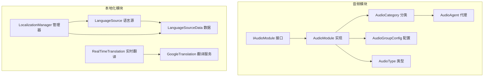
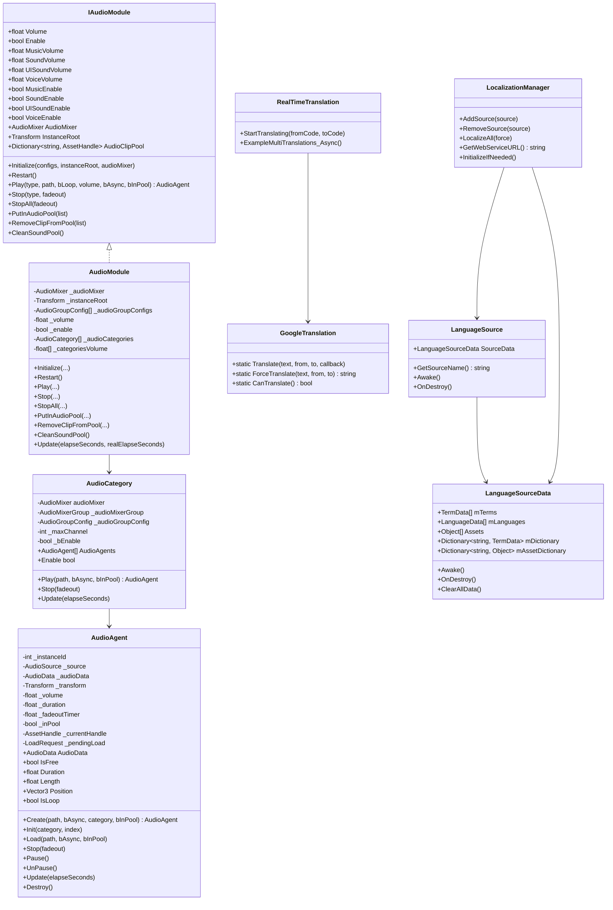
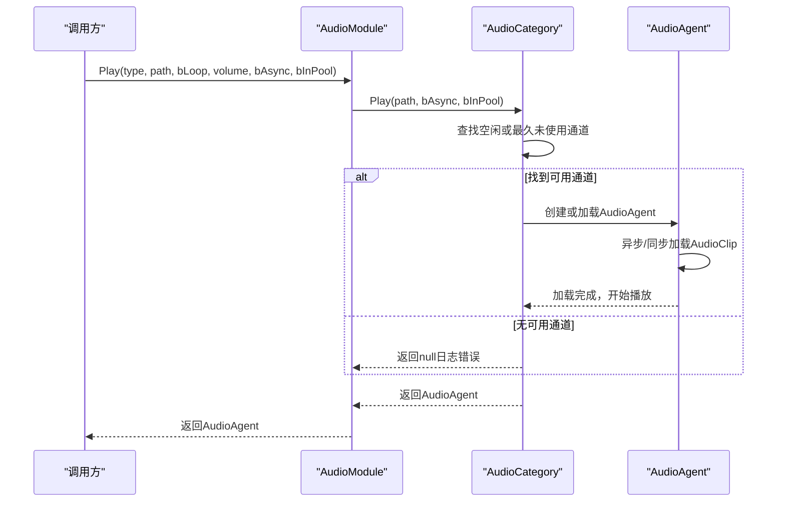
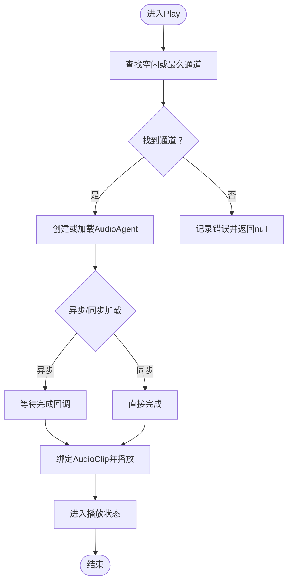
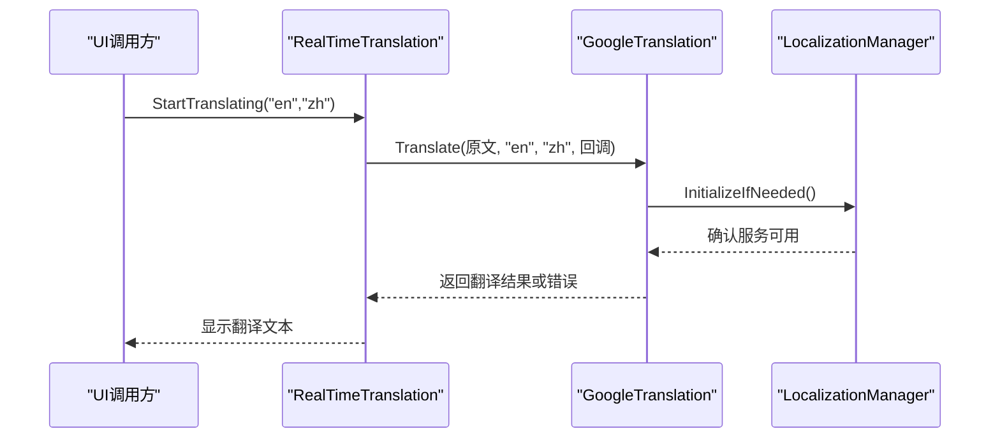
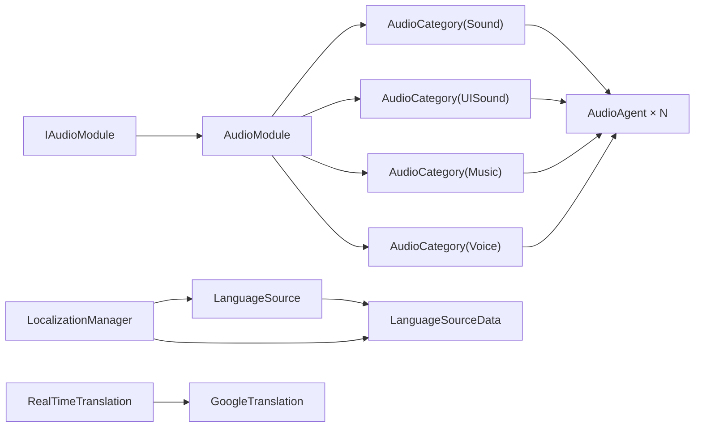

# 音频与本地化API

<cite>
**本文档引用的文件**
- [IAudioModule.cs](file://Assets/TEngine/Runtime/Module/AudioModule/IAudioModule.cs)
- [AudioModule.cs](file://Assets/TEngine/Runtime/Module/AudioModule/AudioModule.cs)
- [AudioCategory.cs](file://Assets/TEngine/Runtime/Module/AudioModule/AudioCategory.cs)
- [AudioAgent.cs](file://Assets/TEngine/Runtime/Module/AudioModule/AudioAgent.cs)
- [AudioGroupConfig.cs](file://Assets/TEngine/Runtime/Module/AudioModule/AudioGroupConfig.cs)
- [AudioType.cs](file://Assets/TEngine/Runtime/Module/AudioModule/AudioType.cs)
- [AudioSetting.asset](file://Assets/TEngine/Settings/AudioSetting.asset)
- [LanguageSource.cs](file://Assets/TEngine/Runtime/Module/LocalizationModule/Core/LanguageSource/LanguageSource.cs)
- [LanguageSourceData.cs](file://Assets/TEngine/Runtime/Module/LocalizationModule/Core/LanguageSource/LanguageSourceData.cs)
- [RealTimeTranslation.cs](file://Assets/TEngine/Runtime/Module/LocalizationModule/Core/Extension/RealTimeTranslation.cs)
- [GoogleTranslation.cs](file://Assets/TEngine/Runtime/Module/LocalizationModule/Core/Google/GoogleTranslation.cs)
- [LocalizationManager.cs](file://Assets/TEngine/Runtime/Module/LocalizationModule/LocalizationManager.cs)
</cite>

## 目录
1. [简介](#简介)
2. [项目结构](#项目结构)
3. [核心组件](#核心组件)
4. [架构总览](#架构总览)
5. [详细组件分析](#详细组件分析)
6. [依赖关系分析](#依赖关系分析)
7. [性能考虑](#性能考虑)
8. [故障排查指南](#故障排查指南)
9. [结论](#结论)
10. [附录](#附录)

## 简介
本文件为TEngine音频与本地化API的权威参考文档，覆盖以下主题：
- 音频模块：音量控制、音频分类、播放管理、混音器配置、资源池与通道复用策略
- 本地化模块：语言切换、文本翻译、参数替换、实时翻译、多语言资源管理与缓存策略
- 集成示例与配置指南：如何在项目中正确初始化与使用音频与本地化能力

## 项目结构
TEngine将音频与本地化能力分别封装为独立模块，位于Runtime/Module目录下：
- 音频模块：AudioModule（接口、实现、分类、代理、配置、类型）
- 本地化模块：LocalizationModule（语言源、管理器、Google翻译扩展）

图表来源
- [IAudioModule.cs:1-128](file://Assets/TEngine/Runtime/Module/AudioModule/IAudioModule.cs#L1-L128)
- [AudioModule.cs:1-571](file://Assets/TEngine/Runtime/Module/AudioModule/AudioModule.cs#L1-L571)
- [AudioCategory.cs:1-196](file://Assets/TEngine/Runtime/Module/AudioModule/AudioCategory.cs#L1-L196)
- [AudioAgent.cs:1-434](file://Assets/TEngine/Runtime/Module/AudioModule/AudioAgent.cs#L1-L434)
- [AudioGroupConfig.cs:1-70](file://Assets/TEngine/Runtime/Module/AudioModule/AudioGroupConfig.cs#L1-L70)
- [AudioType.cs:1-34](file://Assets/TEngine/Runtime/Module/AudioModule/AudioType.cs#L1-L34)
- [LanguageSource.cs:1-179](file://Assets/TEngine/Runtime/Module/LocalizationModule/Core/LanguageSource/LanguageSource.cs#L1-L179)
- [LanguageSourceData.cs:1-177](file://Assets/TEngine/Runtime/Module/LocalizationModule/Core/LanguageSource/LanguageSourceData.cs#L1-L177)
- [RealTimeTranslation.cs:1-132](file://Assets/TEngine/Runtime/Module/LocalizationModule/Core/Extension/RealTimeTranslation.cs#L1-L132)
- [GoogleTranslation.cs:1-87](file://Assets/TEngine/Runtime/Module/LocalizationModule/Core/Google/GoogleTranslation.cs#L1-L87)
- [LocalizationManager.cs](file://Assets/TEngine/Runtime/Module/LocalizationModule/LocalizationManager.cs)

章节来源
- [IAudioModule.cs:1-128](file://Assets/TEngine/Runtime/Module/AudioModule/IAudioModule.cs#L1-L128)
- [AudioModule.cs:1-571](file://Assets/TEngine/Runtime/Module/AudioModule/AudioModule.cs#L1-L571)
- [LanguageSource.cs:1-179](file://Assets/TEngine/Runtime/Module/LocalizationModule/Core/LanguageSource/LanguageSource.cs#L1-L179)
- [LanguageSourceData.cs:1-177](file://Assets/TEngine/Runtime/Module/LocalizationModule/Core/LanguageSource/LanguageSourceData.cs#L1-L177)
- [RealTimeTranslation.cs:1-132](file://Assets/TEngine/Runtime/Module/LocalizationModule/Core/Extension/RealTimeTranslation.cs#L1-L132)
- [GoogleTranslation.cs:1-87](file://Assets/TEngine/Runtime/Module/LocalizationModule/Core/Google/GoogleTranslation.cs#L1-L87)
- [LocalizationManager.cs](file://Assets/TEngine/Runtime/Module/LocalizationModule/LocalizationManager.cs)

## 核心组件
- 音频模块接口与实现
  - IAudioModule：定义音量、开关、混音器、实例根节点、音频池与播放/停止/预加载等API
  - AudioModule：具体实现，负责初始化、重启、播放调度、停止、资源池管理与每帧更新
- 音频分类与代理
  - AudioCategory：按AudioType分组，维护通道列表、最大通道数、启用状态与播放/停止/更新
  - AudioAgent：单个音频播放代理，负责加载、播放、停止、渐出、状态机与生命周期
- 配置与类型
  - AudioGroupConfig：每类音频的轨道配置（音量、通道数、3D衰减等）
  - AudioType：音频分类枚举（Sound、UISound、Music、Voice、Max）
- 本地化模块
  - LanguageSource/LanguageSourceData：语言源与数据容器，包含术语、语言、资产字典与Google同步配置
  - RealTimeTranslation：实时翻译演示脚本
  - GoogleTranslation：基于Google的翻译服务调用入口
  - LocalizationManager：本地化管理器，统一管理语言源、翻译、参数替换、目标组件等

章节来源
- [IAudioModule.cs:1-128](file://Assets/TEngine/Runtime/Module/AudioModule/IAudioModule.cs#L1-L128)
- [AudioModule.cs:1-571](file://Assets/TEngine/Runtime/Module/AudioModule/AudioModule.cs#L1-L571)
- [AudioCategory.cs:1-196](file://Assets/TEngine/Runtime/Module/AudioModule/AudioCategory.cs#L1-L196)
- [AudioAgent.cs:1-434](file://Assets/TEngine/Runtime/Module/AudioModule/AudioAgent.cs#L1-L434)
- [AudioGroupConfig.cs:1-70](file://Assets/TEngine/Runtime/Module/AudioModule/AudioGroupConfig.cs#L1-L70)
- [AudioType.cs:1-34](file://Assets/TEngine/Runtime/Module/AudioModule/AudioType.cs#L1-L34)
- [LanguageSource.cs:1-179](file://Assets/TEngine/Runtime/Module/LocalizationModule/Core/LanguageSource/LanguageSource.cs#L1-L179)
- [LanguageSourceData.cs:1-177](file://Assets/TEngine/Runtime/Module/LocalizationModule/Core/LanguageSource/LanguageSourceData.cs#L1-L177)
- [RealTimeTranslation.cs:1-132](file://Assets/TEngine/Runtime/Module/LocalizationModule/Core/Extension/RealTimeTranslation.cs#L1-L132)
- [GoogleTranslation.cs:1-87](file://Assets/TEngine/Runtime/Module/LocalizationModule/Core/Google/GoogleTranslation.cs#L1-L87)
- [LocalizationManager.cs](file://Assets/TEngine/Runtime/Module/LocalizationModule/LocalizationManager.cs)

## 架构总览
音频与本地化模块均通过TEngine模块系统进行注册与管理，遵循“接口+实现”的分层设计，确保解耦与可扩展性。

图表来源
- [IAudioModule.cs:1-128](file://Assets/TEngine/Runtime/Module/AudioModule/IAudioModule.cs#L1-L128)
- [AudioModule.cs:1-571](file://Assets/TEngine/Runtime/Module/AudioModule/AudioModule.cs#L1-L571)
- [AudioCategory.cs:1-196](file://Assets/TEngine/Runtime/Module/AudioModule/AudioCategory.cs#L1-L196)
- [AudioAgent.cs:1-434](file://Assets/TEngine/Runtime/Module/AudioModule/AudioAgent.cs#L1-L434)
- [LanguageSource.cs:1-179](file://Assets/TEngine/Runtime/Module/LocalizationModule/Core/LanguageSource/LanguageSource.cs#L1-L179)
- [LanguageSourceData.cs:1-177](file://Assets/TEngine/Runtime/Module/LocalizationModule/Core/LanguageSource/LanguageSourceData.cs#L1-L177)
- [RealTimeTranslation.cs:1-132](file://Assets/TEngine/Runtime/Module/LocalizationModule/Core/Extension/RealTimeTranslation.cs#L1-L132)
- [GoogleTranslation.cs:1-87](file://Assets/TEngine/Runtime/Module/LocalizationModule/Core/Google/GoogleTranslation.cs#L1-L87)
- [LocalizationManager.cs](file://Assets/TEngine/Runtime/Module/LocalizationModule/LocalizationManager.cs)

## 详细组件分析

### 音频模块API详解
- 接口与属性
  - 总音量与总开关：控制全局音量与静音
  - 分类音量与开关：Music、Sound、UISound、Voice四类音量与开关
  - 混音器与实例根节点：AudioMixer与实例化根Transform
  - 音频池：Dictionary<string, AssetHandle>，用于缓存已加载的AudioClip
- 初始化与重启
  - Initialize：传入AudioGroupConfig数组、实例根节点、AudioMixer；内部构建各AudioCategory并初始化通道
  - Restart：清理资源池与销毁所有AudioAgent后重新初始化
- 播放与停止
  - Play：根据AudioType选择AudioCategory，复用或新建AudioAgent；支持异步加载、资源池、循环与音量参数
  - Stop/StopAll：按类型或全部停止；支持渐消
- 资源池管理
  - PutInAudioPool：批量预加载并加入池
  - RemoveClipFromPool：从池中移除指定项
  - CleanSoundPool：清空池并释放句柄
- 更新循环
  - Update：遍历各AudioCategory更新其代理状态

图表来源
- [AudioModule.cs:441-458](file://Assets/TEngine/Runtime/Module/AudioModule/AudioModule.cs#L441-L458)
- [AudioCategory.cs:122-164](file://Assets/TEngine/Runtime/Module/AudioModule/AudioCategory.cs#L122-L164)
- [AudioAgent.cs:228-264](file://Assets/TEngine/Runtime/Module/AudioModule/AudioAgent.cs#L228-L264)

章节来源
- [IAudioModule.cs:1-128](file://Assets/TEngine/Runtime/Module/AudioModule/IAudioModule.cs#L1-L128)
- [AudioModule.cs:1-571](file://Assets/TEngine/Runtime/Module/AudioModule/AudioModule.cs#L1-L571)
- [AudioCategory.cs:1-196](file://Assets/TEngine/Runtime/Module/AudioModule/AudioCategory.cs#L1-L196)
- [AudioAgent.cs:1-434](file://Assets/TEngine/Runtime/Module/AudioModule/AudioAgent.cs#L1-L434)

### 音频分类与代理机制
- AudioCategory
  - 维护AudioMixerGroup与AudioAgent列表
  - Enable控制该分类是否允许播放；禁用时会停止所有代理
  - Play策略：优先空闲通道，否则选择持续时间最长的通道进行渐出复用
- AudioAgent
  - 生命周期：None → Loading → Playing → FadingOut → End
  - 支持渐出停止、暂停/恢复、循环切换、位置与音量控制
  - 资源池：命中则直接使用池中句柄，否则异步/同步加载后写入池（若启用池化）

图表来源
- [AudioCategory.cs:122-164](file://Assets/TEngine/Runtime/Module/AudioModule/AudioCategory.cs#L122-L164)
- [AudioAgent.cs:228-362](file://Assets/TEngine/Runtime/Module/AudioModule/AudioAgent.cs#L228-L362)

章节来源
- [AudioCategory.cs:1-196](file://Assets/TEngine/Runtime/Module/AudioModule/AudioCategory.cs#L1-L196)
- [AudioAgent.cs:1-434](file://Assets/TEngine/Runtime/Module/AudioModule/AudioAgent.cs#L1-L434)

### 配置与类型
- AudioGroupConfig
  - 字段：名称、静音标志、初始音量、通道数、AudioType、3D衰减模式、最小/最大距离
  - 作用：为每个AudioType提供独立的轨道配置
- AudioType
  - 枚举：Sound、UISound、Music、Voice、Max
  - 与AudioMixer中的组名需保持一致

章节来源
- [AudioGroupConfig.cs:1-70](file://Assets/TEngine/Runtime/Module/AudioModule/AudioGroupConfig.cs#L1-L70)
- [AudioType.cs:1-34](file://Assets/TEngine/Runtime/Module/AudioModule/AudioType.cs#L1-L34)
- [AudioSetting.asset:1-48](file://Assets/TEngine/Settings/AudioSetting.asset#L1-L48)

### 本地化模块API详解
- LanguageSource/LanguageSourceData
  - 语言源组件与数据容器，维护术语、语言、资产字典
  - 提供Awake/OnDestroy生命周期钩子，自动注册/注销至LocalizationManager
  - 支持Google同步配置与编辑器相关设置
- RealTimeTranslation
  - 示例脚本，展示如何调用GoogleTranslation进行单次/多次实时翻译
- GoogleTranslation
  - Translate(text, from, to, callback)：异步翻译
  - ForceTranslate(text, from, to)：阻塞式翻译（谨慎使用）
  - CanTranslate：检查服务可用性与配置完整性
- LocalizationManager
  - AddSource/RemoveSource：多语言源管理
  - LocalizeAll：对场景内目标组件进行一次性本地化刷新
  - GetWebServiceURL/InitializeIfNeeded：服务URL与初始化辅助

图表来源
- [RealTimeTranslation.cs:43-63](file://Assets/TEngine/Runtime/Module/LocalizationModule/Core/Extension/RealTimeTranslation.cs#L43-L63)
- [GoogleTranslation.cs:21-59](file://Assets/TEngine/Runtime/Module/LocalizationModule/Core/Google/GoogleTranslation.cs#L21-L59)
- [LocalizationManager.cs](file://Assets/TEngine/Runtime/Module/LocalizationModule/LocalizationManager.cs)

章节来源
- [LanguageSource.cs:1-179](file://Assets/TEngine/Runtime/Module/LocalizationModule/Core/LanguageSource/LanguageSource.cs#L1-L179)
- [LanguageSourceData.cs:1-177](file://Assets/TEngine/Runtime/Module/LocalizationModule/Core/LanguageSource/LanguageSourceData.cs#L1-L177)
- [RealTimeTranslation.cs:1-132](file://Assets/TEngine/Runtime/Module/LocalizationModule/Core/Extension/RealTimeTranslation.cs#L1-L132)
- [GoogleTranslation.cs:1-87](file://Assets/TEngine/Runtime/Module/LocalizationModule/Core/Google/GoogleTranslation.cs#L1-L87)
- [LocalizationManager.cs](file://Assets/TEngine/Runtime/Module/LocalizationModule/LocalizationManager.cs)

### 本地化管理器与翻译服务
- 多语言资源管理
  - 通过LanguageSourceData维护术语字典与语言列表，支持忽略设备语言、大小写敏感、缺失翻译行为等
  - 支持资产字典（字体、图集等），便于UI渲染与本地化资源引用
- 翻译服务集成
  - GoogleTranslation封装了查询构建、并发翻译、结果重建与错误处理
  - 支持批量翻译与阻塞式翻译两种模式
- 缓存策略
  - 术语与资产字典在Awake时建立，避免重复序列化开销
  - 本地化刷新可通过LocalizationManager统一触发

章节来源
- [LanguageSourceData.cs:1-177](file://Assets/TEngine/Runtime/Module/LocalizationModule/Core/LanguageSource/LanguageSourceData.cs#L1-L177)
- [GoogleTranslation.cs:1-87](file://Assets/TEngine/Runtime/Module/LocalizationModule/Core/Google/GoogleTranslation.cs#L1-L87)
- [LocalizationManager.cs](file://Assets/TEngine/Runtime/Module/LocalizationModule/LocalizationManager.cs)

## 依赖关系分析
- 音频模块
  - IAudioModule ← AudioModule：接口与实现分离
  - AudioModule → AudioCategory × N：按AudioType分组管理
  - AudioCategory → AudioAgent × N：通道级播放代理
  - AudioAgent → IResourceModule：资源加载
- 本地化模块
  - LanguageSource → LanguageSourceData：组件与数据分离
  - LocalizationManager → LanguageSource/LanguageSourceData：集中管理
  - RealTimeTranslation → GoogleTranslation：演示调用
  - GoogleTranslation → LocalizationManager：服务可用性检查

图表来源
- [IAudioModule.cs:1-128](file://Assets/TEngine/Runtime/Module/AudioModule/IAudioModule.cs#L1-L128)
- [AudioModule.cs:1-571](file://Assets/TEngine/Runtime/Module/AudioModule/AudioModule.cs#L1-L571)
- [AudioCategory.cs:1-196](file://Assets/TEngine/Runtime/Module/AudioModule/AudioCategory.cs#L1-L196)
- [AudioAgent.cs:1-434](file://Assets/TEngine/Runtime/Module/AudioModule/AudioAgent.cs#L1-L434)
- [LanguageSource.cs:1-179](file://Assets/TEngine/Runtime/Module/LocalizationModule/Core/LanguageSource/LanguageSource.cs#L1-L179)
- [LanguageSourceData.cs:1-177](file://Assets/TEngine/Runtime/Module/LocalizationModule/Core/LanguageSource/LanguageSourceData.cs#L1-L177)
- [RealTimeTranslation.cs:1-132](file://Assets/TEngine/Runtime/Module/LocalizationModule/Core/Extension/RealTimeTranslation.cs#L1-L132)
- [GoogleTranslation.cs:1-87](file://Assets/TEngine/Runtime/Module/LocalizationModule/Core/Google/GoogleTranslation.cs#L1-L87)
- [LocalizationManager.cs](file://Assets/TEngine/Runtime/Module/LocalizationModule/LocalizationManager.cs)

章节来源
- [IAudioModule.cs:1-128](file://Assets/TEngine/Runtime/Module/AudioModule/IAudioModule.cs#L1-L128)
- [AudioModule.cs:1-571](file://Assets/TEngine/Runtime/Module/AudioModule/AudioModule.cs#L1-L571)
- [AudioCategory.cs:1-196](file://Assets/TEngine/Runtime/Module/AudioModule/AudioCategory.cs#L1-L196)
- [AudioAgent.cs:1-434](file://Assets/TEngine/Runtime/Module/AudioModule/AudioAgent.cs#L1-L434)
- [LanguageSource.cs:1-179](file://Assets/TEngine/Runtime/Module/LocalizationModule/Core/LanguageSource/LanguageSource.cs#L1-L179)
- [LanguageSourceData.cs:1-177](file://Assets/TEngine/Runtime/Module/LocalizationModule/Core/LanguageSource/LanguageSourceData.cs#L1-L177)
- [RealTimeTranslation.cs:1-132](file://Assets/TEngine/Runtime/Module/LocalizationModule/Core/Extension/RealTimeTranslation.cs#L1-L132)
- [GoogleTranslation.cs:1-87](file://Assets/TEngine/Runtime/Module/LocalizationModule/Core/Google/GoogleTranslation.cs#L1-L87)
- [LocalizationManager.cs](file://Assets/TEngine/Runtime/Module/LocalizationModule/LocalizationManager.cs)

## 性能考虑
- 音频
  - 通道复用：当无空闲通道时，优先复用最久未使用的AudioAgent，减少创建销毁开销
  - 渐出停止：Stop(fadeout)避免突停噪声，同时平滑过渡
  - 资源池：PutInAudioPool/RemoveClipFromPool/CleanSoundPool降低重复加载成本
  - 3D衰减：合理设置minDistance/maxDistance与RolloffMode，平衡性能与听感
  - **资源泄漏防护**：AudioAgent 通过 `_currentHandle`（AssetHandle）追踪已加载资源，`Destroy()` 时对非池化 handle 执行 `Dispose()`；若有未完成的异步加载（`_pendingLoad`），延迟释放直到加载完成后清理，防止句柄泄漏
- 本地化
  - 术语与资产字典：一次性建立，避免频繁序列化
  - 批量翻译：使用GoogleTranslation的批量接口减少网络往返
  - 服务可用性检查：CanTranslate提前判断，避免无效请求

[本节为通用指导，无需列出章节来源]

## 故障排查指南
- 音频
  - 无法播放：检查Enable与各分类Enable；确认AudioMixer与组名一致；查看日志错误提示
  - 音量无效：确认Volume与分类音量映射到AudioMixer对应的dB值
  - 资源池异常：检查池中句柄是否被过早释放；使用CleanSoundPool重置
- 本地化
  - 翻译失败：检查LocalizationManager的WebServiceURL配置；确认CanTranslate返回true
  - 术语缺失：检查LanguageSourceData的mDictionary与mTerms是否正确填充
  - UI未刷新：调用LocalizationManager.LocalizeAll(force: true)强制刷新

章节来源
- [AudioModule.cs:441-493](file://Assets/TEngine/Runtime/Module/AudioModule/AudioModule.cs#L441-L493)
- [AudioAgent.cs:270-307](file://Assets/TEngine/Runtime/Module/AudioModule/AudioAgent.cs#L270-L307)
- [GoogleTranslation.cs:11-15](file://Assets/TEngine/Runtime/Module/LocalizationModule/Core/Google/GoogleTranslation.cs#L11-L15)
- [LanguageSourceData.cs:106-117](file://Assets/TEngine/Runtime/Module/LocalizationModule/Core/LanguageSource/LanguageSourceData.cs#L106-L117)

## 结论
TEngine的音频与本地化模块通过清晰的接口与分层设计，提供了完善的音量控制、分类管理、播放调度、资源池与多语言翻译能力。建议在项目中：
- 使用AudioSetting.asset统一配置各类音频轨道参数
- 合理规划通道数量与3D衰减模型，优化性能与体验
- 利用资源池与批量翻译提升加载与渲染效率
- 在需要时通过LocalizationManager统一刷新UI本地化

[本节为总结性内容，无需列出章节来源]

## 附录
- 配置文件位置与用途
  - AudioSetting.asset：音频轨道配置（音量、通道数、3D衰减等）
- 常用API速查
  - 音频：IAudioModule.Play/Stop/StopAll/Initialize/Restart/资源池管理
  - 本地化：LanguageSourceData.Awake/OnDestroy、GoogleTranslation.Translate/ForceTranslate、LocalizationManager.AddSource/RemoveSource/LocalizeAll

章节来源
- [AudioSetting.asset:1-48](file://Assets/TEngine/Settings/AudioSetting.asset#L1-L48)
- [IAudioModule.cs:1-128](file://Assets/TEngine/Runtime/Module/AudioModule/IAudioModule.cs#L1-L128)
- [LanguageSourceData.cs:106-117](file://Assets/TEngine/Runtime/Module/LocalizationModule/Core/LanguageSource/LanguageSourceData.cs#L106-L117)
- [GoogleTranslation.cs:21-81](file://Assets/TEngine/Runtime/Module/LocalizationModule/Core/Google/GoogleTranslation.cs#L21-L81)
- [LocalizationManager.cs](file://Assets/TEngine/Runtime/Module/LocalizationModule/LocalizationManager.cs)