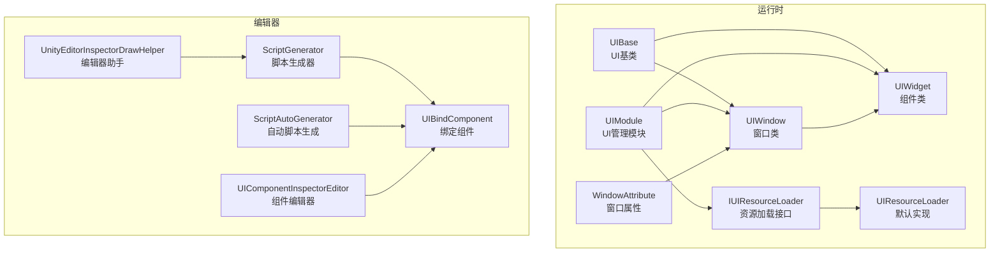
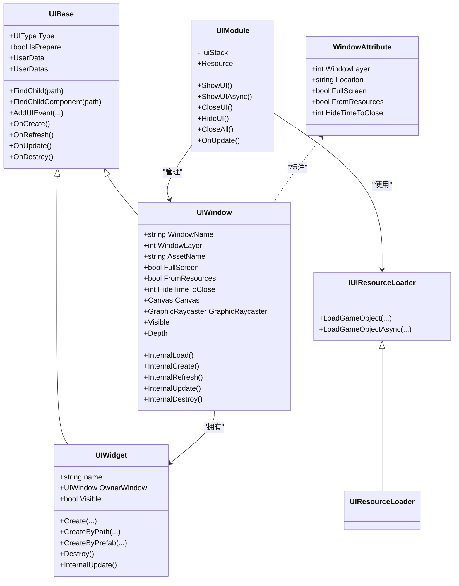
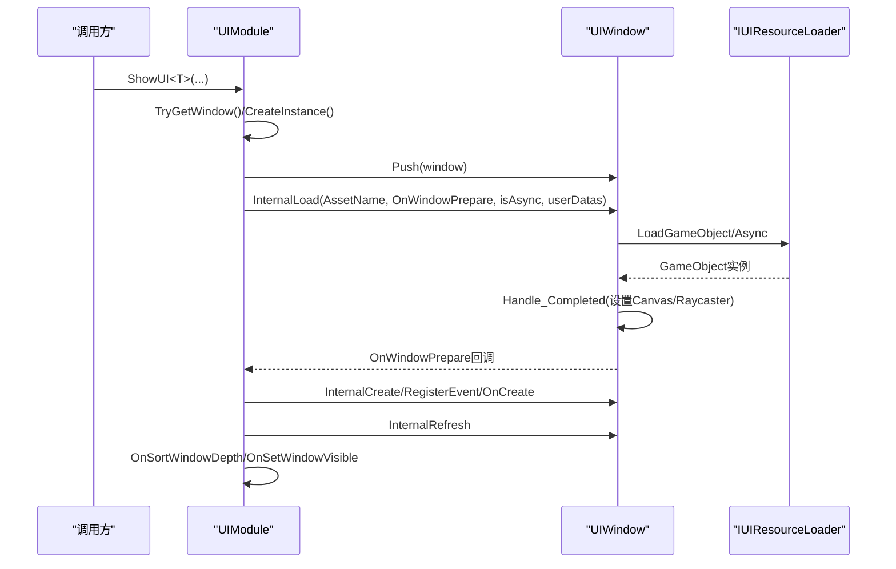
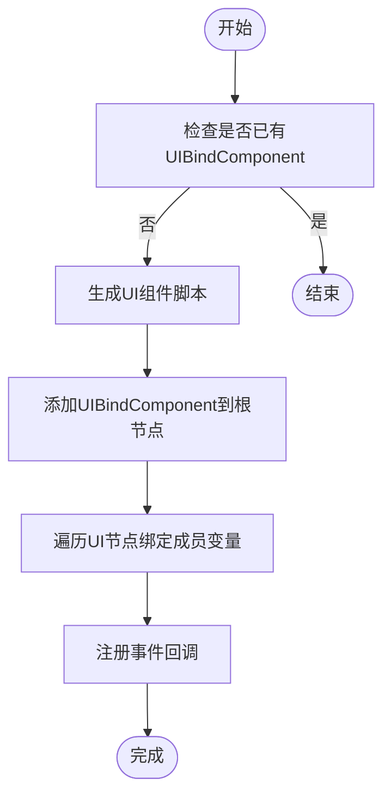
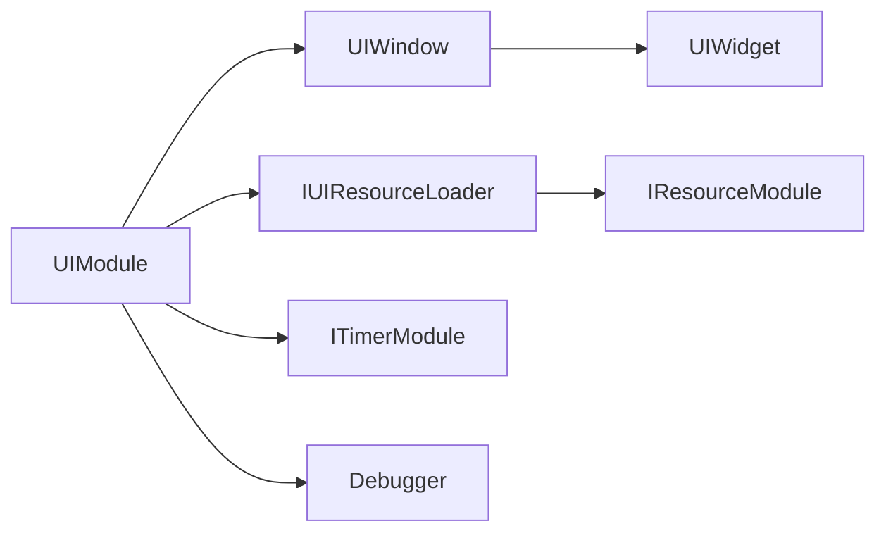

# UI框架架构

<cite>
**本文档引用的文件**
- [UIBase.cs](file://Assets/GameScripts/HotFix/GameLogic/Module/UIModule/UIBase.cs)
- [UIWindow.cs](file://Assets/GameScripts/HotFix/GameLogic/Module/UIModule/UIWindow.cs)
- [UIWidget.cs](file://Assets/GameScripts/HotFix/GameLogic/Module/UIModule/UIWidget.cs)
- [UIModule.cs](file://Assets/GameScripts/HotFix/GameLogic/Module/UIModule/UIModule.cs)
- [WindowAttribute.cs](file://Assets/GameScripts/HotFix/GameLogic/Module/UIModule/WindowAttribute.cs)
- [IUIResourceLoader.cs](file://Assets/GameScripts/HotFix/GameLogic/Module/UIModule/IUIResourceLoader.cs)
- [UIBindComponent.cs](file://Assets/GameScripts/HotFix/GameLogic/Module/UIModule/UIBindComponent/UIBindComponent.cs)
- [UIComponentEditor.cs](file://Assets/GameScripts/HotFix/GameLogic/Module/UIModule/UIBindComponent/UIComponentEditor.cs)
- [ScriptGenerator.cs](file://Assets/Editor/UIScriptGenerator/ScriptGenerator.cs)
- [ScriptAutoGenerator.cs](file://Assets/Editor/UIScriptGenerator/ScriptAutoGenerator.cs)
- [UIComponentInspectorEditor.cs](file://Assets/Editor/UIScriptGenerator/UIComponentInspectorEditor.cs)
- [UnityEditorInspectorDrawHelper.cs](file://Assets/Editor/TEngineSettingsProvider/UnityEditorInspectorDrawHelper.cs)
</cite>

## 目录
1. [简介](#简介)
2. [项目结构](#项目结构)
3. [核心组件](#核心组件)
4. [架构总览](#架构总览)
5. [详细组件分析](#详细组件分析)
6. [依赖关系分析](#依赖关系分析)
7. [性能考虑](#性能考虑)
8. [故障排除指南](#故障排除指南)
9. [结论](#结论)
10. [附录](#附录)

## 简介
本文件系统性梳理TEngine UI框架的整体架构与实现细节，重点覆盖以下方面：
- UI系统核心设计理念与分层结构：UIBase基类、UIWindow窗口类、UIWidget组件类的设计模式与继承关系
- UI绑定机制：UIBindComponent组件的作用、组件绑定流程、生命周期管理
- 模块化设计：UI模块的注册、初始化、销毁等生命周期管理
- 扩展点与自定义UI组件开发指南
- UI系统与其他模块（资源、计时器、调试器等）的交互与集成模式

## 项目结构
UI框架位于GameLogic模块的UIModule目录下，采用“基类+窗口+组件”的分层设计，并通过UIModule统一调度。编辑器侧提供脚本自动生成工具，辅助快速构建UI组件代码。

**图表来源**
- [UIModule.cs:15-94](file://Assets/GameScripts/HotFix/GameLogic/Module/UIModule/UIModule.cs#L15-L94)
- [UIBase.cs:18-146](file://Assets/GameScripts/HotFix/GameLogic/Module/UIModule/UIBase.cs#L18-L146)
- [UIWindow.cs:11-51](file://Assets/GameScripts/HotFix/GameLogic/Module/UIModule/UIWindow.cs#L11-L51)
- [UIWidget.cs:7-33](file://Assets/GameScripts/HotFix/GameLogic/Module/UIModule/UIWidget.cs#L7-L33)
- [WindowAttribute.cs:20-77](file://Assets/GameScripts/HotFix/GameLogic/Module/UIModule/WindowAttribute.cs#L20-L77)
- [IUIResourceLoader.cs:11-68](file://Assets/GameScripts/HotFix/GameLogic/Module/UIModule/IUIResourceLoader.cs#L11-L68)
- [ScriptGenerator.cs:70-99](file://Assets/Editor/UIScriptGenerator/ScriptGenerator.cs#L70-L99)
- [ScriptAutoGenerator.cs:106-135](file://Assets/Editor/UIScriptGenerator/ScriptAutoGenerator.cs#L106-L135)
- [UIComponentInspectorEditor.cs:12-36](file://Assets/Editor/UIScriptGenerator/UIComponentInspectorEditor.cs#L12-L36)
- [UnityEditorInspectorDrawHelper.cs:152-167](file://Assets/Editor/TEngineSettingsProvider/UnityEditorInspectorDrawHelper.cs#L152-L167)

**章节来源**
- [UIModule.cs:15-94](file://Assets/GameScripts/HotFix/GameLogic/Module/UIModule/UIModule.cs#L15-L94)
- [UIBase.cs:18-146](file://Assets/GameScripts/HotFix/GameLogic/Module/UIModule/UIBase.cs#L18-L146)
- [UIWindow.cs:11-51](file://Assets/GameScripts/HotFix/GameLogic/Module/UIModule/UIWindow.cs#L11-L51)
- [UIWidget.cs:7-33](file://Assets/GameScripts/HotFix/GameLogic/Module/UIModule/UIWidget.cs#L7-L33)
- [WindowAttribute.cs:20-77](file://Assets/GameScripts/HotFix/GameLogic/Module/UIModule/WindowAttribute.cs#L20-L77)
- [IUIResourceLoader.cs:11-68](file://Assets/GameScripts/HotFix/GameLogic/Module/UIModule/IUIResourceLoader.cs#L11-L68)
- [ScriptGenerator.cs:70-99](file://Assets/Editor/UIScriptGenerator/ScriptGenerator.cs#L70-L99)
- [ScriptAutoGenerator.cs:106-135](file://Assets/Editor/UIScriptGenerator/ScriptAutoGenerator.cs#L106-L135)
- [UIComponentInspectorEditor.cs:12-36](file://Assets/Editor/UIScriptGenerator/UIComponentInspectorEditor.cs#L12-L36)
- [UnityEditorInspectorDrawHelper.cs:152-167](file://Assets/Editor/TEngineSettingsProvider/UnityEditorInspectorDrawHelper.cs#L152-L167)

## 核心组件
- UIBase：UI系统抽象基类，定义UI类型、父子关系、生命周期钩子（创建、刷新、更新、销毁）、事件管理、查找子节点与组件等通用能力。支持数据绑定扩展（Bind / BindText 等便捷方法）。
- UIWindow：窗口类，负责窗口生命周期（加载、创建、刷新、更新、销毁）、可见性与交互控制、层级排序、刘海屏适配、资源加载策略。集成 DataContext 自动创建和销毁。
- UIWidget：组件类，负责组件生命周期、可见性、更新树维护、父子关系建立、Canvas层级继承。通过 Parent 链获取 Window 的 DataContext。
- UIModule：UI管理模块，负责窗口栈管理、窗口显示/隐藏/关闭、层级排序、可见性计算、资源加载、编辑器脚本生成集成
- 数据绑定：BindableProperty（响应式属性）、ObservableList（响应式集合）、BatchScheduler（帧级合并）、DataContext（多源聚合+转换）。详见 [UI数据绑定](UI数据绑定.md)。
- WindowAttribute：窗口元数据，声明窗口层级、资源路径、是否全屏、隐藏后自动关闭等属性
- IUIResourceLoader/UIResourceLoader：UI资源加载接口与默认实现，封装资源模块的GameObject加载能力
- UIBindComponent：编辑器绑定组件，存储UI组件引用，供代码生成器使用

**章节来源**
- [UIBase.cs:18-608](file://Assets/GameScripts/HotFix/GameLogic/Module/UIModule/UIBase.cs#L18-L608)
- [UIWindow.cs:11-524](file://Assets/GameScripts/HotFix/GameLogic/Module/UIModule/UIWindow.cs#L11-L524)
- [UIWidget.cs:7-315](file://Assets/GameScripts/HotFix/GameLogic/Module/UIModule/UIWidget.cs#L7-L315)
- [UIModule.cs:15-732](file://Assets/GameScripts/HotFix/GameLogic/Module/UIModule/UIModule.cs#L15-L732)
- [WindowAttribute.cs:20-77](file://Assets/GameScripts/HotFix/GameLogic/Module/UIModule/WindowAttribute.cs#L20-L77)
- [IUIResourceLoader.cs:11-68](file://Assets/GameScripts/HotFix/GameLogic/Module/UIModule/IUIResourceLoader.cs#L11-L68)
- [UIBindComponent.cs:17-38](file://Assets/GameScripts/HotFix/GameLogic/Module/UIModule/UIBindComponent/UIBindComponent.cs#L17-L38)

## 架构总览
UI框架采用“模块驱动 + 层次化UI树 + 统一调度”的架构：
- UIModule作为全局调度中心，维护窗口栈，按层级进行深度排序与可见性计算
- UIWindow负责窗口级生命周期与渲染参数（Canvas、Raycaster），UIWidget负责组件级生命周期与更新树
- 资源加载通过IUIResourceLoader抽象，屏蔽具体资源模块差异
- 编辑器侧通过脚本生成器与绑定组件，自动化生成UI组件代码并绑定UI元素

**图表来源**
- [UIBase.cs:18-608](file://Assets/GameScripts/HotFix/GameLogic/Module/UIModule/UIBase.cs#L18-L608)
- [UIWindow.cs:11-524](file://Assets/GameScripts/HotFix/GameLogic/Module/UIModule/UIWindow.cs#L11-L524)
- [UIWidget.cs:7-315](file://Assets/GameScripts/HotFix/GameLogic/Module/UIModule/UIWidget.cs#L7-L315)
- [UIModule.cs:15-732](file://Assets/GameScripts/HotFix/GameLogic/Module/UIModule/UIModule.cs#L15-L732)
- [WindowAttribute.cs:20-77](file://Assets/GameScripts/HotFix/GameLogic/Module/UIModule/WindowAttribute.cs#L20-L77)
- [IUIResourceLoader.cs:11-68](file://Assets/GameScripts/HotFix/GameLogic/Module/UIModule/IUIResourceLoader.cs#L11-L68)
- [UIBindComponent.cs:17-38](file://Assets/GameScripts/HotFix/GameLogic/Module/UIModule/UIBindComponent/UIBindComponent.cs#L17-L38)

## 详细组件分析

### UIBase：UI基类
- 设计要点
  - 抽象UI类型与父子关系，提供查找子节点与组件的便捷方法
  - 生命周期钩子：OnCreate、OnRefresh、OnUpdate、OnDestroy；支持事件管理与内存池复用
  - 更新树优化：延迟构建“需要更新”的子节点列表，避免每帧遍历全量子节点
- 关键能力
  - 依赖注入：静态Injector回调，便于在创建时注入服务
  - 事件系统：基于GameEventMgr的多泛型重载事件注册
  - 子组件创建：CreateWidget系列方法，支持路径、资源、预制体等多种创建方式
- 性能特性
  - _updateListValid与_listUpdateChild配合，仅在子节点变更时重建更新列表
  - _isSortingOrderDirty用于延迟排序，减少不必要的Canvas排序开销

**章节来源**
- [UIBase.cs:18-608](file://Assets/GameScripts/HotFix/GameLogic/Module/UIModule/UIBase.cs#L18-L608)

### UIWindow：窗口类
- 设计要点
  - 窗口级生命周期：InternalLoad（资源加载）、InternalCreate（组件绑定与事件注册）、InternalRefresh（刷新）、InternalUpdate（窗口与子组件更新）、InternalDestroy（销毁）
  - 可见性与交互：Visible属性控制图层与Raycaster开关；FullScreen窗口的遮挡逻辑
  - 层级排序：Depth属性基于Canvas.overrideSorting与sortingOrder，支持子Canvas同步
  - 安全区域适配：SetUIFit/SetUINotFit支持刘海屏适配
- 关键流程
  - ShowUI/ShowUIAsync：创建实例、压栈、异步加载资源、回调OnWindowPrepare后进入创建与刷新阶段
  - HideUI：支持定时自动关闭，结合计时器模块
  - CloseAll/CloseAllWithOut：批量关闭窗口
- 性能特性
  - 内部维护_updateListValid与_listUpdateChild，窗口级更新树优化
  - Visible切换时批量设置子Canvas与子Raycaster，减少多次查询

**图表来源**
- [UIModule.cs:298-386](file://Assets/GameScripts/HotFix/GameLogic/Module/UIModule/UIModule.cs#L298-L386)
- [UIWindow.cs:314-354](file://Assets/GameScripts/HotFix/GameLogic/Module/UIModule/UIWindow.cs#L314-L354)
- [IUIResourceLoader.cs:11-68](file://Assets/GameScripts/HotFix/GameLogic/Module/UIModule/IUIResourceLoader.cs#L11-L68)

**章节来源**
- [UIWindow.cs:11-524](file://Assets/GameScripts/HotFix/GameLogic/Module/UIModule/UIWindow.cs#L11-L524)
- [UIModule.cs:298-386](file://Assets/GameScripts/HotFix/GameLogic/Module/UIModule/UIModule.cs#L298-L386)

### UIWidget：组件类
- 设计要点
  - 组件级生命周期：Create/CreateByPath/CreateByPrefab，统一走CreateImp
  - 可见性控制：Visible属性直接映射到gameObject.activeSelf，并触发OnSetVisible
  - Canvas层级继承：RestChildCanvas确保子Canvas继承父Canvas的排序，避免层级错乱
  - 更新树：InternalUpdate维护组件自身的更新列表，支持嵌套组件的增量更新
- 关键流程
  - CreateImp：设置基础属性、重设子Canvas层级、建立父子关系、注入、绑定、注册事件、OnCreate/OnRefresh
  - OnDestroyWidget：递归销毁子组件，清理事件，最后销毁gameObject
- 性能特性
  - 与UIBase一致的更新树优化策略，减少每帧遍历成本

**章节来源**
- [UIWidget.cs:7-315](file://Assets/GameScripts/HotFix/GameLogic/Module/UIModule/UIWidget.cs#L7-L315)

### UIModule：UI管理模块
- 设计要点
  - 窗口栈管理：Push/Pop/IsContains/GetWindow，按层级与顺序维护窗口栈
  - 可见性与深度：OnSortWindowDepth按层级分配深度，OnSetWindowVisible根据FullScreen进行遮挡处理
  - 生命周期：ShowUI/ShowUIAsync/CloseUI/HideUI/CloseAll，统一调度窗口生命周期
  - 资源加载：通过IUIResourceLoader抽象，支持同步与异步加载
  - **单例实例化**：`UIModule` 继承 `Singleton<UIModule>`，`_instanceRoot`（UIRoot）和 `_resourceLoader`（Resource）为实例字段，UIBase/UIWindow/UIWidget 内部通过 `UIModule.Instance` 访问
  - **加载失败防护**：UIWindow 新增 `LoadFailed` 标志，异步等待方法检测此标志后立即返回 `null`，防止僵尸窗口
- 关键流程
  - ShowUI：TryGetWindow命中则重新压栈并触发TryInvoke；未命中则创建实例并InternalLoad
  - HideUI：若HideTimeToClose>0则延时关闭，否则直接CloseUI
  - OnUpdate：遍历窗口栈逐个调用InternalUpdate
- 性能特性
  - 窗口栈按层级分段，减少排序与可见性计算复杂度
  - 异步加载与超时保护，避免阻塞主线程

**章节来源**
- [UIModule.cs:15-732](file://Assets/GameScripts/HotFix/GameLogic/Module/UIModule/UIModule.cs#L15-L732)

### WindowAttribute：窗口属性
- 作用：为UI窗口类提供元数据，声明窗口层级、资源路径、是否全屏、隐藏后自动关闭等
- 使用：UIModule.CreateInstance时读取属性，若未标注则使用默认值

**章节来源**
- [WindowAttribute.cs:20-77](file://Assets/GameScripts/HotFix/GameLogic/Module/UIModule/WindowAttribute.cs#L20-L77)

### IUIResourceLoader/UIResourceLoader：资源加载
- 接口职责：统一UI资源加载API，支持同步与异步加载GameObject
- 默认实现：委托给IResourceModule，实现跨模块解耦

**章节来源**
- [IUIResourceLoader.cs:11-68](file://Assets/GameScripts/HotFix/GameLogic/Module/UIModule/IUIResourceLoader.cs#L11-L68)

### UIBindComponent与编辑器脚本生成
- UIBindComponent：在UI根节点挂载，保存组件引用列表，供代码生成器使用
- 脚本生成器：根据UI结构自动生成组件类，注入UIBindComponent引用，绑定成员变量与事件
- 编辑器集成：Unity编辑器中点击“绑定UI组件”按钮，自动生成脚本并添加UIBindComponent

**图表来源**
- [ScriptAutoGenerator.cs:106-135](file://Assets/Editor/UIScriptGenerator/ScriptAutoGenerator.cs#L106-L135)
- [UIComponentInspectorEditor.cs:12-36](file://Assets/Editor/UIScriptGenerator/UIComponentInspectorEditor.cs#L12-L36)
- [UnityEditorInspectorDrawHelper.cs:152-167](file://Assets/Editor/TEngineSettingsProvider/UnityEditorInspectorDrawHelper.cs#L152-L167)
- [ScriptGenerator.cs:70-99](file://Assets/Editor/UIScriptGenerator/ScriptGenerator.cs#L70-L99)

**章节来源**
- [UIBindComponent.cs:17-38](file://Assets/GameScripts/HotFix/GameLogic/Module/UIModule/UIBindComponent/UIBindComponent.cs#L17-L38)
- [UIComponentEditor.cs:7-27](file://Assets/GameScripts/HotFix/GameLogic/Module/UIModule/UIBindComponent/UIComponentEditor.cs#L7-L27)
- [ScriptAutoGenerator.cs:106-135](file://Assets/Editor/UIScriptGenerator/ScriptAutoGenerator.cs#L106-L135)
- [UIComponentInspectorEditor.cs:12-36](file://Assets/Editor/UIScriptGenerator/UIComponentInspectorEditor.cs#L12-L36)
- [UnityEditorInspectorDrawHelper.cs:152-167](file://Assets/Editor/TEngineSettingsProvider/UnityEditorInspectorDrawHelper.cs#L152-L167)
- [ScriptGenerator.cs:70-99](file://Assets/Editor/UIScriptGenerator/ScriptGenerator.cs#L70-L99)

## 依赖关系分析
- 组件耦合
  - UIWindow与UIWidget：父子关系强耦合，UIWindow负责窗口生命周期，UIWidget负责组件生命周期
  - UIModule与UIWindow：UIModule集中管理窗口栈与可见性，UIWindow暴露Visible/Depth等状态
  - UIModule与IUIResourceLoader：通过接口解耦资源加载，便于替换实现
- 外部依赖
  - 计时器模块：HideUI使用计时器模块实现定时关闭
  - 资源模块：IUIResourceLoader委托IResourceModule执行实际加载
  - 调试器模块：根据调试器配置决定是否启用错误日志

**图表来源**
- [UIModule.cs:49-94](file://Assets/GameScripts/HotFix/GameLogic/Module/UIModule/UIModule.cs#L49-L94)
- [UIWindow.cs:514-522](file://Assets/GameScripts/HotFix/GameLogic/Module/UIModule/UIWindow.cs#L514-L522)
- [IUIResourceLoader.cs:40-67](file://Assets/GameScripts/HotFix/GameLogic/Module/UIModule/IUIResourceLoader.cs#L40-L67)

**章节来源**
- [UIModule.cs:49-94](file://Assets/GameScripts/HotFix/GameLogic/Module/UIModule/UIModule.cs#L49-L94)
- [UIWindow.cs:514-522](file://Assets/GameScripts/HotFix/GameLogic/Module/UIModule/UIWindow.cs#L514-L522)
- [IUIResourceLoader.cs:40-67](file://Assets/GameScripts/HotFix/GameLogic/Module/UIModule/IUIResourceLoader.cs#L40-L67)

## 性能考虑
- 更新树优化
  - UIBase/UIWidget均维护_updateListValid与_listUpdateChild，仅在子节点变更时重建更新列表，降低每帧遍历成本
- 层级排序
  - UIWindow的Depth设置采用Canvas.sortingOrder与overrideSorting，批量设置子Canvas，避免重复查询
- 异步加载
  - UIModule对ShowUIAsync提供超时保护，防止长时间等待导致卡顿
- 资源管理
  - IUIResourceLoader封装资源加载，避免UI层直接依赖具体资源实现

[本节为通用性能建议，不直接分析具体文件]

## 故障排除指南
- “未找到UIRoot”
  - 现象：UIModule初始化失败，抛出致命日志
  - 处理：确认场景中存在名为“UIRoot”的节点，并包含Canvas与Camera
- “缺少UIBindComponent”
  - 现象：代码生成器提示根物体缺少UIBindComponent
  - 处理：在根节点添加UIBindComponent组件，或通过编辑器按钮一键生成
- “Canvas缺失”
  - 现象：窗口加载完成后抛出异常，提示未找到Canvas
  - 处理：确保UI资源根节点包含Canvas组件，并启用overrideSorting
- “组件未激活”
  - 现象：组件Visible=false但未显示
  - 处理：检查父节点Visible状态与Canvas层级，确认UIRoot图层正确

**章节来源**
- [UIModule.cs:49-61](file://Assets/GameScripts/HotFix/GameLogic/Module/UIModule/UIModule.cs#L49-L61)
- [UIWindow.cs:464-488](file://Assets/GameScripts/HotFix/GameLogic/Module/UIModule/UIWindow.cs#L464-L488)
- [UnityEditorInspectorDrawHelper.cs:152-167](file://Assets/Editor/TEngineSettingsProvider/UnityEditorInspectorDrawHelper.cs#L152-L167)

## 结论
TEngine UI框架通过清晰的层次化设计与模块化调度，实现了窗口与组件的统一生命周期管理、高效的更新树优化以及灵活的资源加载策略。编辑器侧的脚本生成与绑定组件进一步提升了开发效率与一致性。通过WindowAttribute与UIModule的组合，开发者可以轻松声明窗口属性并统一管理窗口栈与可见性。

[本节为总结性内容，不直接分析具体文件]

## 附录

### 扩展点与自定义UI组件开发指南
- 自定义UIWidget
  - 继承UIWidget，实现OnCreate/OnRefresh/OnUpdate/OnDestroy
  - 在OnCreate中完成组件绑定与事件注册，在OnRefresh中刷新数据
- 自定义UIWindow
  - 继承UIWindow，实现OnCreate/OnRefresh/OnUpdate/OnDestroy
  - 如需全屏遮挡效果，设置FullScreen=true；如需隐藏后自动关闭，设置HideTimeToClose>0
- 自定义资源加载
  - 实现IUIResourceLoader接口，替换UIModule.Resource以接入自定义资源系统
- 使用WindowAttribute
  - 在窗口类上标注WindowAttribute，声明层级、资源路径、是否全屏、隐藏后自动关闭等

**章节来源**
- [UIWidget.cs:7-315](file://Assets/GameScripts/HotFix/GameLogic/Module/UIModule/UIWidget.cs#L7-L315)
- [UIWindow.cs:11-524](file://Assets/GameScripts/HotFix/GameLogic/Module/UIModule/UIWindow.cs#L11-L524)
- [WindowAttribute.cs:20-77](file://Assets/GameScripts/HotFix/GameLogic/Module/UIModule/WindowAttribute.cs#L20-L77)
- [IUIResourceLoader.cs:11-68](file://Assets/GameScripts/HotFix/GameLogic/Module/UIModule/IUIResourceLoader.cs#L11-L68)