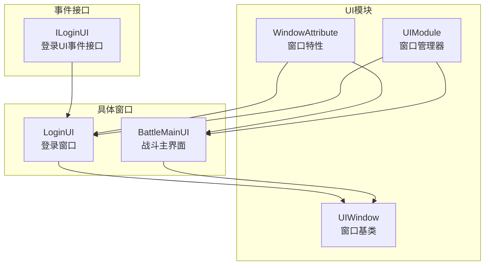
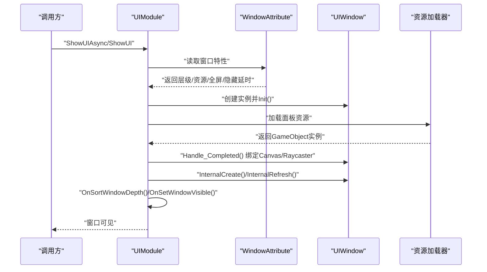
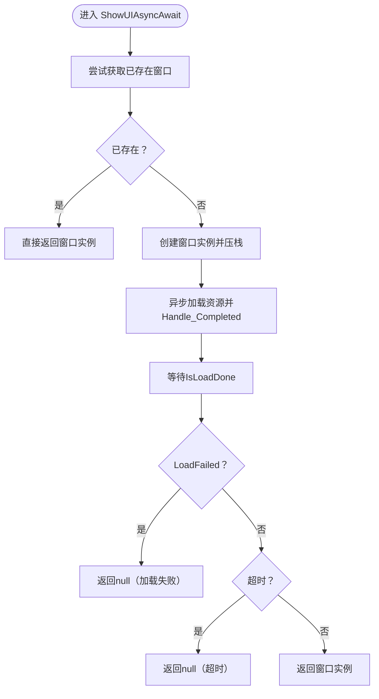
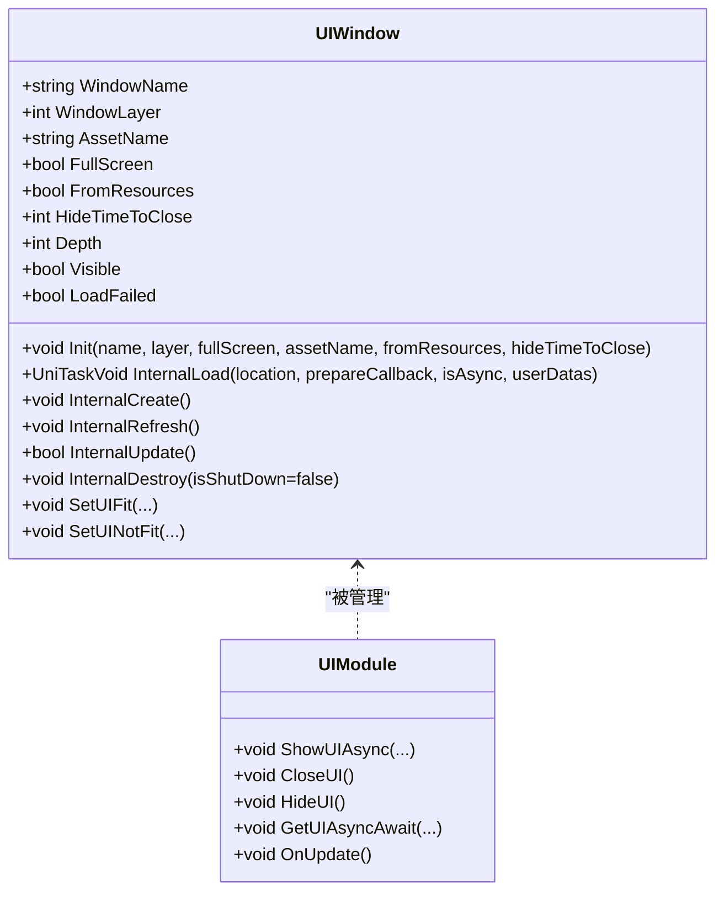
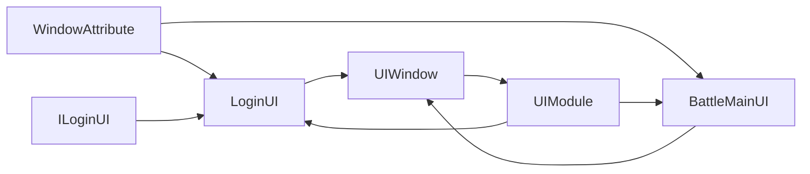

# UI窗口管理

<cite>
**本文引用的文件**
- [UIModule.cs](file://Assets/GameScripts/HotFix/GameLogic/Module/UIModule/UIModule.cs)
- [WindowAttribute.cs](file://Assets/GameScripts/HotFix/GameLogic/Module/UIModule/WindowAttribute.cs)
- [UIWindow.cs](file://Assets/GameScripts/HotFix/GameLogic/Module/UIModule/UIWindow.cs)
- [LoginUI.cs](file://Assets/GameScripts/HotFix/GameLogic/UI/LoginUI/LoginUI.cs)
- [BattleMainUI.cs](file://Assets/GameScripts/HotFix/GameLogic/UI/BattleMainUI/BattleMainUI.cs)
- [ILoginUI.cs](file://Assets/GameScripts/HotFix/GameLogic/IEvent/ILoginUI.cs)
</cite>

## 目录
1. [简介](#简介)
2. [项目结构](#项目结构)
3. [核心组件](#核心组件)
4. [架构总览](#架构总览)
5. [详细组件分析](#详细组件分析)
6. [依赖关系分析](#依赖关系分析)
7. [性能考量](#性能考量)
8. [故障排查指南](#故障排查指南)
9. [结论](#结论)
10. [附录](#附录)

## 简介
本文件系统化梳理TEngine的UI窗口管理体系，围绕窗口的创建、显示、隐藏、销毁与生命周期展开；详解WindowAttribute特性在窗口层级、资源定位、显示模式等方面的配置；阐述UIModule模块的窗口注册、调度与切换机制；并结合登录窗口与战斗主界面的实际案例，说明窗口开发流程、窗口间通信与数据传递、状态同步等高级能力。

## 项目结构
UI窗口管理相关代码主要位于热更工程GameLogic中，采用“模块+窗口”的分层组织：
- UIModule：UI管理模块，负责窗口的注册、调度、深度排序、可见性控制、生命周期管理等
- UIWindow：窗口基类，封装UI实例化、Canvas/Raycaster绑定、生命周期钩子、更新循环等
- WindowAttribute：窗口特性，声明窗口层级、资源定位、全屏、资源来源、隐藏延时等元信息
- 具体窗口：如LoginUI、BattleMainUI等，通过特性标注窗口元信息并继承UIWindow
- 事件接口：如ILoginUI，定义窗口级业务事件契约，便于跨模块解耦通信

图表来源
- [UIModule.cs:15-94](file://Assets/GameScripts/HotFix/GameLogic/Module/UIModule/UIModule.cs#L15-L94)
- [WindowAttribute.cs:20-77](file://Assets/GameScripts/HotFix/GameLogic/Module/UIModule/WindowAttribute.cs#L20-L77)
- [UIWindow.cs:11-524](file://Assets/GameScripts/HotFix/GameLogic/Module/UIModule/UIWindow.cs#L11-L524)
- [LoginUI.cs:7-11](file://Assets/GameScripts/HotFix/GameLogic/UI/LoginUI/LoginUI.cs#L7-L11)
- [BattleMainUI.cs:7-29](file://Assets/GameScripts/HotFix/GameLogic/UI/BattleMainUI/BattleMainUI.cs#L7-L29)
- [ILoginUI.cs:5-11](file://Assets/GameScripts/HotFix/GameLogic/IEvent/ILoginUI.cs#L5-L11)

章节来源
- [UIModule.cs:15-94](file://Assets/GameScripts/HotFix/GameLogic/Module/UIModule/UIModule.cs#L15-L94)
- [WindowAttribute.cs:20-77](file://Assets/GameScripts/HotFix/GameLogic/Module/UIModule/WindowAttribute.cs#L20-L77)
- [UIWindow.cs:11-524](file://Assets/GameScripts/HotFix/GameLogic/Module/UIModule/UIWindow.cs#L11-L524)
- [LoginUI.cs:7-11](file://Assets/GameScripts/HotFix/GameLogic/UI/LoginUI/LoginUI.cs#L7-L11)
- [BattleMainUI.cs:7-29](file://Assets/GameScripts/HotFix/GameLogic/UI/BattleMainUI/BattleMainUI.cs#L7-L29)
- [ILoginUI.cs:5-11](file://Assets/GameScripts/HotFix/GameLogic/IEvent/ILoginUI.cs#L5-L11)

## 核心组件
- UIModule：单例UI管理器，维护窗口栈、层级深度计算、可见性排序、安全区域适配、定时器驱动的延迟隐藏、统一资源加载入口等
- UIWindow：窗口抽象基类，封装资源加载、Canvas/Raycaster绑定、生命周期钩子（创建/刷新/更新/销毁）、可见性与交互性控制、刘海屏适配等
- WindowAttribute：窗口元信息特性，支持窗口层级、资源定位、全屏、资源来源、隐藏延时等配置
- 具体窗口：通过特性声明窗口元信息，继承UIWindow并实现业务逻辑

章节来源
- [UIModule.cs:15-94](file://Assets/GameScripts/HotFix/GameLogic/Module/UIModule/UIModule.cs#L15-L94)
- [UIWindow.cs:11-524](file://Assets/GameScripts/HotFix/GameLogic/Module/UIModule/UIWindow.cs#L11-L524)
- [WindowAttribute.cs:20-77](file://Assets/GameScripts/HotFix/GameLogic/Module/UIModule/WindowAttribute.cs#L20-L77)
- [LoginUI.cs:7-11](file://Assets/GameScripts/HotFix/GameLogic/UI/LoginUI/LoginUI.cs#L7-L11)
- [BattleMainUI.cs:7-29](file://Assets/GameScripts/HotFix/GameLogic/UI/BattleMainUI/BattleMainUI.cs#L7-L29)

## 架构总览
UI窗口管理采用“特性驱动 + 单例管理 + 生命周期钩子”的架构：
- 特性驱动：通过WindowAttribute声明窗口元信息，UIModule在创建窗口时读取特性并初始化窗口
- 单例管理：UIModule作为全局唯一入口，集中处理窗口的创建、显示、隐藏、关闭、深度排序与可见性
- 生命周期钩子：UIWindow提供InternalLoad/Prepare/Create/Refresh/Update/Destroy等内部流程，UIModule在关键节点触发回调与排序

图表来源
- [UIModule.cs:298-364](file://Assets/GameScripts/HotFix/GameLogic/Module/UIModule/UIModule.cs#L298-L364)
- [UIModule.cs:472-478](file://Assets/GameScripts/HotFix/GameLogic/Module/UIModule/UIModule.cs#L472-L478)
- [UIWindow.cs:314-336](file://Assets/GameScripts/HotFix/GameLogic/Module/UIModule/UIWindow.cs#L314-L336)
- [UIWindow.cs:464-502](file://Assets/GameScripts/HotFix/GameLogic/Module/UIModule/UIWindow.cs#L464-L502)
- [WindowAttribute.cs:45-77](file://Assets/GameScripts/HotFix/GameLogic/Module/UIModule/WindowAttribute.cs#L45-L77)

## 详细组件分析

### UIModule：窗口管理器
职责与机制：
- 初始化与释放：查找UIRoot、初始化资源加载器、挂接不销毁、配置错误日志
- 安全区域适配：ApplyScreenSafeRect/SimulateIPhoneXNotchScreen，支持异形屏刘海适配
- 窗口查询与存在性判断：HasWindow/GetTopWindow/IsAnyLoading
- 打开窗口：ShowUI/ShowUIAsync/ShowUIAsyncAwait，内部委派至ShowUIImp/ShowUIAwaitImp
- 关闭与隐藏：CloseUI/HideUI，支持隐藏延时自动关闭
- 窗口栈管理：Push/Pop/CloseAll/CloseAllWithOut，维护窗口顺序与层级
- 可见性与深度：OnSortWindowDepth/OnSetWindowVisible，按层级与栈序计算sortingOrder与可见性
- 更新循环：OnUpdate遍历窗口执行InternalUpdate

> **架构变更**：`UIModule` 继承自 `Singleton<UIModule>`，其 `_instanceRoot`（UIRoot）和 `_resourceLoader`（Resource）为**实例字段**而非静态字段。UIBase、UIWindow、UIWidget 内部统一通过 `UIModule.Instance.UIRoot` 和 `UIModule.Instance.Resource` 访问资源加载器与 UI 根节点。

关键流程图：ShowUIAsyncAwait

> **注意**：异步等待方法（ShowUIAsyncAwait、GetUIAsyncAwait、GetUIAsync）在轮询 `IsLoadDone` 时会同步检查 `LoadFailed` 标志，若为 `true` 则立即返回 `null`，避免无限等待已失败的窗口。

图表来源
- [UIModule.cs:338-364](file://Assets/GameScripts/HotFix/GameLogic/Module/UIModule/UIModule.cs#L338-L364)
- [UIModule.cs:298-321](file://Assets/GameScripts/HotFix/GameLogic/Module/UIModule/UIModule.cs#L298-L321)
- [UIModule.cs:565-597](file://Assets/GameScripts/HotFix/GameLogic/Module/UIModule/UIModule.cs#L565-L597)

章节来源
- [UIModule.cs:15-94](file://Assets/GameScripts/HotFix/GameLogic/Module/UIModule/UIModule.cs#L15-L94)
- [UIModule.cs:245-478](file://Assets/GameScripts/HotFix/GameLogic/Module/UIModule/UIModule.cs#L245-L478)
- [UIModule.cs:480-516](file://Assets/GameScripts/HotFix/GameLogic/Module/UIModule/UIModule.cs#L480-L516)
- [UIModule.cs:565-597](file://Assets/GameScripts/HotFix/GameLogic/Module/UIModule/UIModule.cs#L565-L597)

### UIWindow：窗口基类
职责与机制：
- 生命周期：InternalLoad/Handle_Completed/InternalCreate/InternalRefresh/InternalUpdate/InternalDestroy
- 资源加载：支持从资源包或Resources加载，绑定Canvas与GraphicRaycaster
- 加载失败处理：`LoadFailed` 属性标记资源加载是否失败，异步等待方法检测此标志后返回 `null`
- 可见性与交互：Visible属性控制Canvas层级与Raycaster开关，Interactable联动
- 深度排序：Depth属性根据sortingOrder与子Canvas同步更新
- 刘海屏适配：SetUIFit/SetUINotFit系列方法
- 事件与回调：TryInvoke在准备就绪时触发回调

类关系图

图表来源
- [UIWindow.cs:237-524](file://Assets/GameScripts/HotFix/GameLogic/Module/UIModule/UIWindow.cs#L237-L524)
- [UIModule.cs:245-478](file://Assets/GameScripts/HotFix/GameLogic/Module/UIModule/UIModule.cs#L245-L478)

章节来源
- [UIWindow.cs:11-524](file://Assets/GameScripts/HotFix/GameLogic/Module/UIModule/UIWindow.cs#L11-L524)

### WindowAttribute：窗口特性
作用与属性：
- 窗口层级：支持Bottom/UI/Top/Tips/System五层
- 资源定位：Location可覆盖默认按类名命名的资源名
- 全屏标记：FullScreen决定窗口可见性传播策略
- 资源来源：FromResources指示是否从Resources加载
- 隐藏延时：HideTimeToClose控制隐藏后自动关闭的延时

章节来源
- [WindowAttribute.cs:8-15](file://Assets/GameScripts/HotFix/GameLogic/Module/UIModule/WindowAttribute.cs#L8-L15)
- [WindowAttribute.cs:20-77](file://Assets/GameScripts/HotFix/GameLogic/Module/UIModule/WindowAttribute.cs#L20-L77)

### 登录窗口 LoginUI
- 通过[Window(UILayer.UI)]声明窗口层级
- 继承UIWindow，可在内部实现脚本生成的成员绑定与业务逻辑
- 通过UIModule.ShowUIAsync/ShowUI打开

章节来源
- [LoginUI.cs:7-11](file://Assets/GameScripts/HotFix/GameLogic/UI/LoginUI/LoginUI.cs#L7-L11)

### 战斗主界面 BattleMainUI
- 通过[Window(UILayer.UI, location:"BattleMainUI")]声明资源定位
- 继承UIWindow，重写ScriptGenerator以绑定子节点与组件
- 通过UIModule.ShowUIAsync/ShowUI打开

章节来源
- [BattleMainUI.cs:7-29](file://Assets/GameScripts/HotFix/GameLogic/UI/BattleMainUI/BattleMainUI.cs#L7-L29)

### 窗口间通信与事件
- 通过事件接口ILoginUI定义ShowLoginUI/CloseLoginUI等业务事件
- 业务模块可通过事件系统触发窗口显示/关闭，实现跨模块解耦
- 窗口内部可通过UIModule.HideUI/CloseUI进行自关闭

章节来源
- [ILoginUI.cs:5-11](file://Assets/GameScripts/HotFix/GameLogic/IEvent/ILoginUI.cs#L5-L11)
- [UIWindow.cs:504-512](file://Assets/GameScripts/HotFix/GameLogic/Module/UIModule/UIWindow.cs#L504-L512)

## 依赖关系分析
- UIModule依赖WindowAttribute解析窗口元信息，并在创建窗口时调用UIWindow.Init
- UIWindow依赖UIModule.UIRoot与资源加载器加载面板，绑定Canvas/Raycaster
- 具体窗口LoginUI/BattleMainUI通过特性声明元信息并继承UIWindow
- 事件接口ILoginUI定义窗口级业务事件，供其他模块调用

图表来源
- [WindowAttribute.cs:45-77](file://Assets/GameScripts/HotFix/GameLogic/Module/UIModule/WindowAttribute.cs#L45-L77)
- [LoginUI.cs:7-11](file://Assets/GameScripts/HotFix/GameLogic/UI/LoginUI/LoginUI.cs#L7-L11)
- [BattleMainUI.cs:7-29](file://Assets/GameScripts/HotFix/GameLogic/UI/BattleMainUI/BattleMainUI.cs#L7-L29)
- [UIWindow.cs:237-524](file://Assets/GameScripts/HotFix/GameLogic/Module/UIModule/UIWindow.cs#L237-L524)
- [UIModule.cs:245-478](file://Assets/GameScripts/HotFix/GameLogic/Module/UIModule/UIModule.cs#L245-L478)
- [ILoginUI.cs:5-11](file://Assets/GameScripts/HotFix/GameLogic/IEvent/ILoginUI.cs#L5-L11)

章节来源
- [UIModule.cs:245-478](file://Assets/GameScripts/HotFix/GameLogic/Module/UIModule/UIModule.cs#L245-L478)
- [UIWindow.cs:237-524](file://Assets/GameScripts/HotFix/GameLogic/Module/UIModule/UIWindow.cs#L237-L524)
- [WindowAttribute.cs:45-77](file://Assets/GameScripts/HotFix/GameLogic/Module/UIModule/WindowAttribute.cs#L45-L77)
- [LoginUI.cs:7-11](file://Assets/GameScripts/HotFix/GameLogic/UI/LoginUI/LoginUI.cs#L7-L11)
- [BattleMainUI.cs:7-29](file://Assets/GameScripts/HotFix/GameLogic/UI/BattleMainUI/BattleMainUI.cs#L7-L29)
- [ILoginUI.cs:5-11](file://Assets/GameScripts/HotFix/GameLogic/IEvent/ILoginUI.cs#L5-L11)

## 性能考量
- 资源加载：优先使用异步加载，避免阻塞主线程；资源来源选择FromResources或资源包按需权衡
- 窗口栈与排序：OnSortWindowDepth按层级与栈序计算sortingOrder，减少不必要的Canvas层级切换
- 可见性控制：OnSetWindowVisible仅对最顶层可见窗口启用交互，降低Raycaster压力
- 更新循环：UIWindow内部按需收集子UIWidget更新列表，避免全量遍历
- 隐藏延时：HideTimeToClose配合定时器，避免频繁显隐造成的抖动与GC

## 故障排查指南
- UIRoot未找到：OnInit阶段会记录致命日志，检查场景中是否存在UIRoot与Canvas
- 缺少Canvas：Handle_Completed阶段若面板无Canvas则抛出异常，确保预制包含Canvas组件
- 窗口重复创建：Push阶段检测重复窗口名，避免栈内重复
- 资源加载失败：检查WindowAttribute.Location与FromResources配置，确认资源路径正确
- 安全区域异常：ApplyScreenSafeRect需依赖CanvasScaler，确保CanvasScaler存在且参考分辨率正确

章节来源
- [UIModule.cs:49-61](file://Assets/GameScripts/HotFix/GameLogic/Module/UIModule/UIModule.cs#L49-L61)
- [UIWindow.cs:484-488](file://Assets/GameScripts/HotFix/GameLogic/Module/UIModule/UIWindow.cs#L484-L488)
- [UIModule.cs:666-704](file://Assets/GameScripts/HotFix/GameLogic/Module/UIModule/UIModule.cs#L666-L704)
- [UIModule.cs:122-149](file://Assets/GameScripts/HotFix/GameLogic/Module/UIModule/UIModule.cs#L122-L149)

## 结论
TEngine的UI窗口管理以UIModule为核心，结合WindowAttribute与UIWindow形成“特性驱动 + 生命周期管理 + 可视化排序”的完整体系。通过统一的资源加载、可见性与深度控制、事件接口与窗口栈管理，实现了窗口的高效创建、显示、隐藏与销毁，并提供了安全区域适配、刘海屏适配、异步等待等高级能力。实际开发中，建议遵循特性声明窗口元信息、在窗口内实现生命周期钩子、通过事件接口进行跨模块通信的实践模式。

## 附录
- 窗口开发步骤
  - 使用[Window(...)]特性声明窗口层级、资源定位、全屏与隐藏延时
  - 继承UIWindow并在内部实现脚本生成与业务逻辑
  - 通过UIModule.ShowUI/ShowUIAsync打开窗口，必要时使用ShowUIAsyncAwait等待加载完成
  - 通过UIModule.HideUI/CloseUI进行隐藏或关闭
- 窗口间通信
  - 定义事件接口（如ILoginUI），在业务模块中触发事件以控制窗口显示/关闭
  - 在窗口内部通过UIModule.HideUI/CloseUI进行自关闭