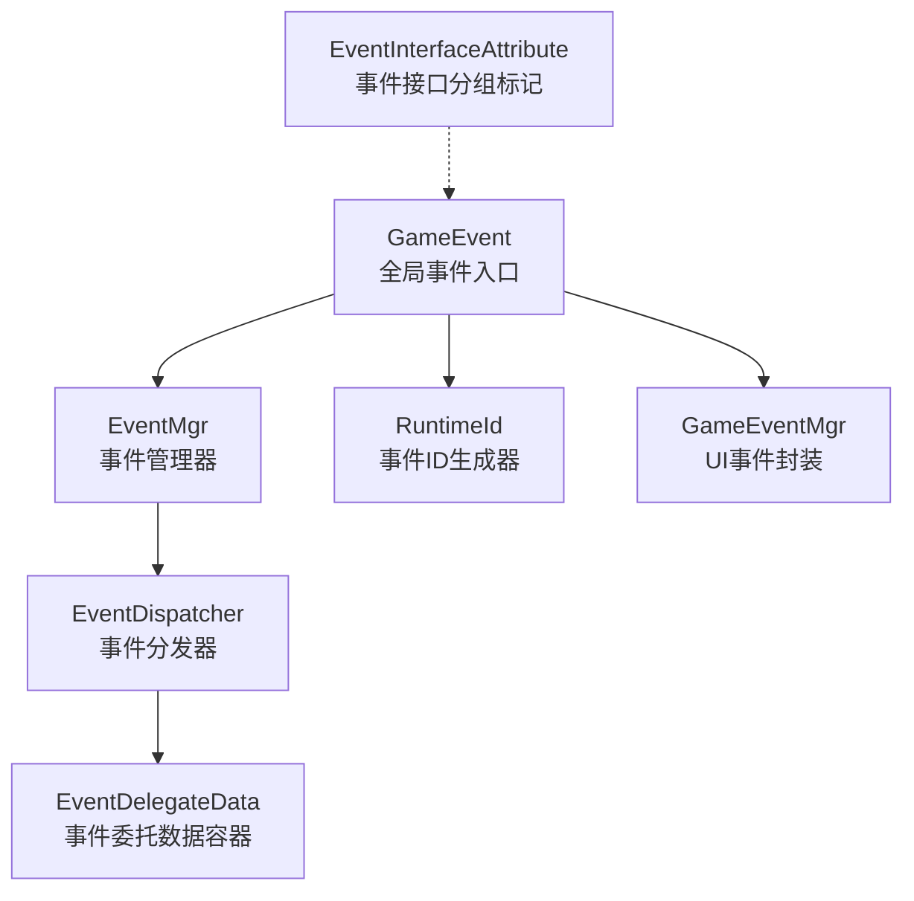
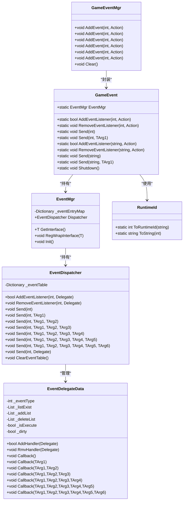
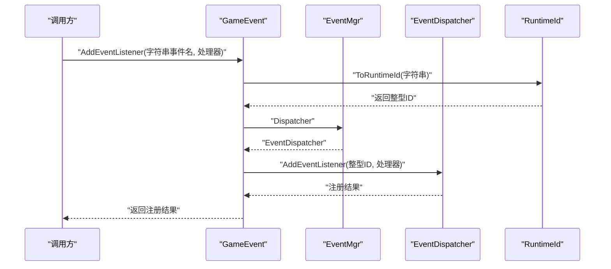
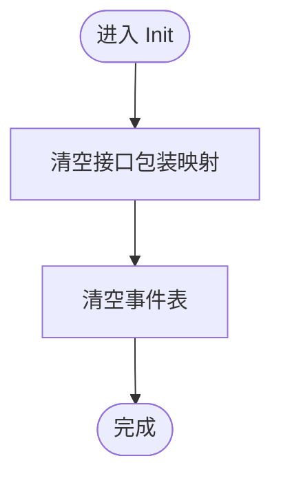
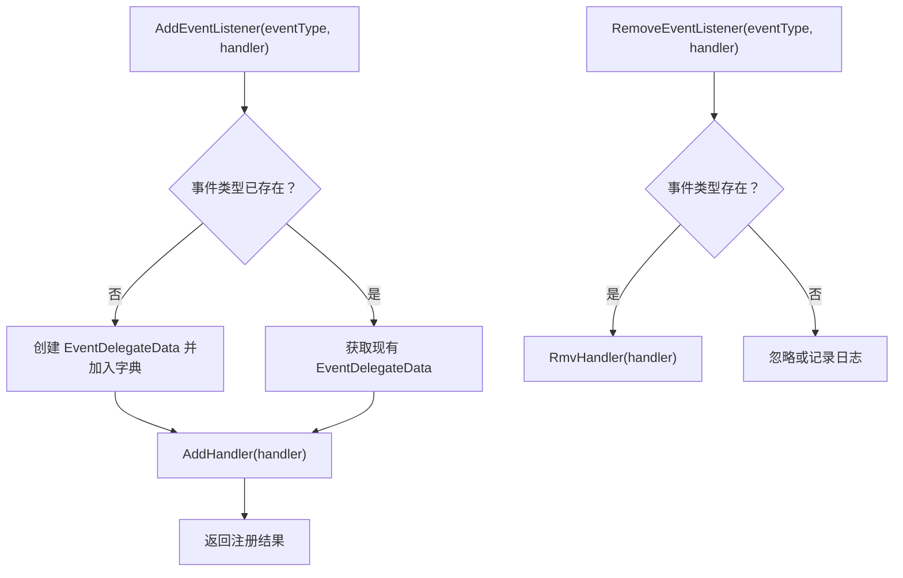
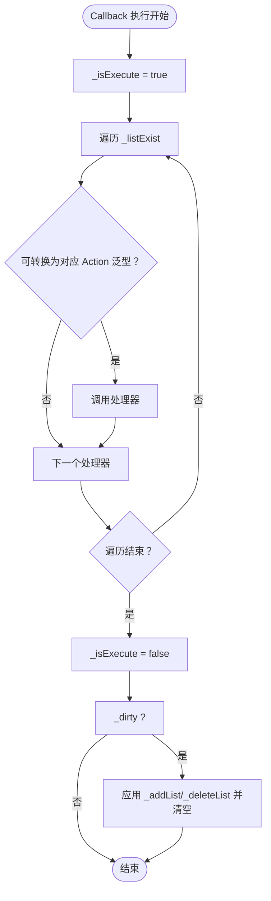
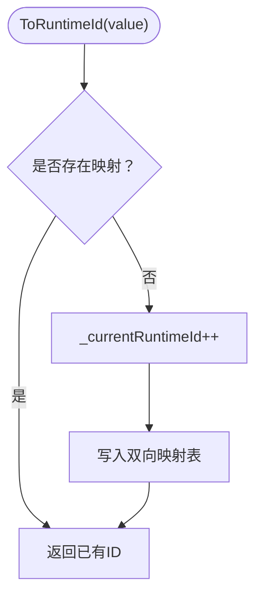
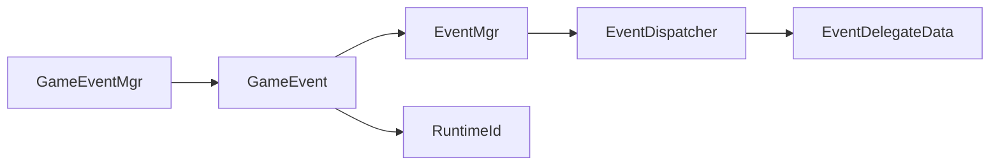

# 事件管理机制

<cite>
**本文引用的文件**   
- [GameEvent.cs](file://Assets/TEngine/Runtime/Core/GameEvent/GameEvent.cs)
- [EventMgr.cs](file://Assets/TEngine/Runtime/Core/GameEvent/EventMgr.cs)
- [EventDispatcher.cs](file://Assets/TEngine/Runtime/Core/GameEvent/EventDispatcher.cs)
- [EventDelegateData.cs](file://Assets/TEngine/Runtime/Core/GameEvent/EventDelegateData.cs)
- [RuntimeId.cs](file://Assets/TEngine/Runtime/Core/GameEvent/RuntimeId.cs)
- [EventInterfaceAttribute.cs](file://Assets/TEngine/Runtime/Core/GameEvent/EventInterfaceAttribute.cs)
- [GameEventMgr.cs](file://Assets/TEngine/Runtime/Core/GameEvent/GameEventMgr.cs)
- [ILoginUI.cs](file://Assets/GameScripts/HotFix/GameLogic/IEvent/ILoginUI.cs)
</cite>

## 目录
1. [引言](#引言)
2. [项目结构](#项目结构)
3. [核心组件](#核心组件)
4. [架构总览](#架构总览)
5. [详细组件分析](#详细组件分析)
6. [依赖关系分析](#依赖关系分析)
7. [性能考量](#性能考量)
8. [故障排查指南](#故障排查指南)
9. [结论](#结论)
10. [附录：使用示例与最佳实践](#附录使用示例与最佳实践)

## 引言
本文件系统性解析 TEngine 的事件管理机制，重点围绕以下目标展开：
- 解释 GameEvent 作为全局事件入口的设计原理，以及其静态事件管理器的单例化实现思路。
- 深入剖析 EventMgr 的职责边界与核心能力：事件分发器的创建、事件处理器的存储结构、事件类型映射机制等。
- 详解 EventDispatcher 的实现细节：事件处理器的注册、查找、移除、分发流程。
- 阐述事件系统的整体架构设计：事件类型标识符的生成与管理、事件处理器的组织结构。
- 提供事件管理机制的使用示例与最佳实践：事件注册的最佳时机、事件处理器的生命周期管理。

## 项目结构
TEngine 的事件系统位于运行时核心模块中，采用“全局门面 + 管理器 + 分发器 + 数据容器”的分层设计。关键文件如下：
- GameEvent：全局事件入口，提供统一的注册、移除、发送接口，并负责将字符串事件名转换为运行时整型 ID。
- EventMgr：事件管理器，负责接口包装注册、事件分发器的持有与初始化清理。
- EventDispatcher：事件分发器，维护事件类型到处理器列表的映射，负责注册、移除与分发。
- EventDelegateData：事件委托数据容器，封装处理器列表、延迟修改队列与执行状态，确保在回调过程中安全地增删处理器。
- RuntimeId：事件类型标识符生成器，提供字符串到整型 ID 的映射与缓存。
- EventInterfaceAttribute：事件接口分组标记，用于按功能域（如 UI、逻辑）进行接口分类。
- GameEventMgr：面向 UI 事件的轻量封装，便于集中管理事件注册与自动注销。

**图表来源**
- [GameEvent.cs:1-601](file://Assets/TEngine/Runtime/Core/GameEvent/GameEvent.cs#L1-L601)
- [EventMgr.cs:1-89](file://Assets/TEngine/Runtime/Core/GameEvent/EventMgr.cs#L1-L89)
- [EventDispatcher.cs:1-188](file://Assets/TEngine/Runtime/Core/GameEvent/EventDispatcher.cs#L1-L188)
- [EventDelegateData.cs:1-266](file://Assets/TEngine/Runtime/Core/GameEvent/EventDelegateData.cs#L1-L266)
- [RuntimeId.cs:1-56](file://Assets/TEngine/Runtime/Core/GameEvent/RuntimeId.cs#L1-L56)
- [GameEventMgr.cs:1-96](file://Assets/TEngine/Runtime/Core/GameEvent/GameEventMgr.cs#L1-L96)
- [EventInterfaceAttribute.cs:1-31](file://Assets/TEngine/Runtime/Core/GameEvent/EventInterfaceAttribute.cs#L1-L31)

**章节来源**
- [GameEvent.cs:1-601](file://Assets/TEngine/Runtime/Core/GameEvent/GameEvent.cs#L1-L601)
- [EventMgr.cs:1-89](file://Assets/TEngine/Runtime/Core/GameEvent/EventMgr.cs#L1-L89)
- [EventDispatcher.cs:1-188](file://Assets/TEngine/Runtime/Core/GameEvent/EventDispatcher.cs#L1-L188)
- [EventDelegateData.cs:1-266](file://Assets/TEngine/Runtime/Core/GameEvent/EventDelegateData.cs#L1-L266)
- [RuntimeId.cs:1-56](file://Assets/TEngine/Runtime/Core/GameEvent/RuntimeId.cs#L1-L56)
- [EventInterfaceAttribute.cs:1-31](file://Assets/TEngine/Runtime/Core/GameEvent/EventInterfaceAttribute.cs#L1-L31)
- [GameEventMgr.cs:1-96](file://Assets/TEngine/Runtime/Core/GameEvent/GameEventMgr.cs#L1-L96)

## 核心组件
- GameEvent：提供静态门面接口，统一暴露事件注册、移除、发送能力；内部持有 EventMgr 实例，通过 RuntimeId 将字符串事件名转换为整型 ID 后交由 EventDispatcher 处理。
- EventMgr：持有 EventDispatcher 实例，负责接口包装注册（RegWrapInterface），以及事件系统初始化与清理（Init）。
- EventDispatcher：维护事件类型到处理器集合的字典映射，提供 AddEventListener、RemoveEventListener、Send 等核心方法。
- EventDelegateData：封装处理器列表与延迟修改队列，支持在回调执行期间安全地增删处理器，避免并发修改异常。
- RuntimeId：提供字符串到整型 ID 的映射与缓存，保证事件类型标识符的稳定性和高效查询。
- EventInterfaceAttribute：为事件接口打上分组标签，便于按功能域组织事件接口。
- GameEventMgr：面向 UI 事件的轻量封装，记录注册过的事件与处理器，便于集中清理。

**章节来源**
- [GameEvent.cs:1-601](file://Assets/TEngine/Runtime/Core/GameEvent/GameEvent.cs#L1-L601)
- [EventMgr.cs:1-89](file://Assets/TEngine/Runtime/Core/GameEvent/EventMgr.cs#L1-L89)
- [EventDispatcher.cs:1-188](file://Assets/TEngine/Runtime/Core/GameEvent/EventDispatcher.cs#L1-L188)
- [EventDelegateData.cs:1-266](file://Assets/TEngine/Runtime/Core/GameEvent/EventDelegateData.cs#L1-L266)
- [RuntimeId.cs:1-56](file://Assets/TEngine/Runtime/Core/GameEvent/RuntimeId.cs#L1-L56)
- [EventInterfaceAttribute.cs:1-31](file://Assets/TEngine/Runtime/Core/GameEvent/EventInterfaceAttribute.cs#L1-L31)
- [GameEventMgr.cs:1-96](file://Assets/TEngine/Runtime/Core/GameEvent/GameEventMgr.cs#L1-L96)

## 架构总览
事件系统采用“门面 + 管理器 + 分发器 + 数据容器”的分层架构：
- GameEvent 作为门面，屏蔽底层细节，提供统一的静态 API。
- EventMgr 负责事件分发器的生命周期与接口包装注册。
- EventDispatcher 负责事件类型到处理器集合的映射与分发。
- EventDelegateData 负责处理器集合的线程安全与延迟修改。
- RuntimeId 负责事件类型标识符的生成与缓存。
- GameEventMgr 提供 UI 事件的便捷封装与自动清理。

**图表来源**
- [GameEvent.cs:1-601](file://Assets/TEngine/Runtime/Core/GameEvent/GameEvent.cs#L1-L601)
- [EventMgr.cs:1-89](file://Assets/TEngine/Runtime/Core/GameEvent/EventMgr.cs#L1-L89)
- [EventDispatcher.cs:1-188](file://Assets/TEngine/Runtime/Core/GameEvent/EventDispatcher.cs#L1-L188)
- [EventDelegateData.cs:1-266](file://Assets/TEngine/Runtime/Core/GameEvent/EventDelegateData.cs#L1-L266)
- [RuntimeId.cs:1-56](file://Assets/TEngine/Runtime/Core/GameEvent/RuntimeId.cs#L1-L56)
- [GameEventMgr.cs:1-96](file://Assets/TEngine/Runtime/Core/GameEvent/GameEventMgr.cs#L1-L96)

## 详细组件分析

### GameEvent：全局事件入口与静态门面
- 设计要点
  - 通过静态字段持有 EventMgr 实例，形成“静态门面 + 单例式管理器”的组合：静态门面负责对外 API，内部持有单例化的管理器实例，避免重复创建。
  - 提供多重重载的 AddEventListener、RemoveEventListener、Send 接口，既支持整型事件 ID，也支持字符串事件名；字符串事件名通过 RuntimeId 转换为整型 ID 后再交由分发器处理。
  - 提供 Shutdown 方法，内部调用 EventMgr.Init，实现事件系统的初始化与清理。
- 关键行为
  - 注册/移除：将事件类型与处理器交由 EventMgr.Dispatcher 处理。
  - 发送：根据事件类型调用 EventMgr.Dispatcher.Send，支持 0~6 个参数的回调分发。
  - 字符串事件名：通过 RuntimeId.ToRuntimeId 将字符串转换为整型 ID，确保事件类型标识符的唯一性与稳定性。

**图表来源**
- [GameEvent.cs:205-285](file://Assets/TEngine/Runtime/Core/GameEvent/GameEvent.cs#L205-L285)
- [RuntimeId.cs:28-44](file://Assets/TEngine/Runtime/Core/GameEvent/RuntimeId.cs#L28-L44)
- [EventMgr.cs:73-73](file://Assets/TEngine/Runtime/Core/GameEvent/EventMgr.cs#L73-L73)
- [EventDispatcher.cs:32-41](file://Assets/TEngine/Runtime/Core/GameEvent/EventDispatcher.cs#L32-L41)

**章节来源**
- [GameEvent.cs:1-601](file://Assets/TEngine/Runtime/Core/GameEvent/GameEvent.cs#L1-L601)

### EventMgr：事件管理器与接口包装
- 职责边界
  - 持有 EventDispatcher 实例，提供 GetDispatcher 获取分发器的能力。
  - 提供接口包装注册（RegWrapInterface<T>），以类型为键存储接口包装对象，便于通过 GetInterface<T>() 获取。
  - 提供 Init 方法，清空接口包装映射与事件表，实现事件系统的初始化与清理。
- 存储结构
  - 使用字典保存接口包装对象，键为接口类型，值为包装数据容器。
- 生命周期
  - 通过 Init 清理事件表与接口包装，避免内存泄漏与残留订阅。

**图表来源**
- [EventMgr.cs:83-87](file://Assets/TEngine/Runtime/Core/GameEvent/EventMgr.cs#L83-L87)

**章节来源**
- [EventMgr.cs:1-89](file://Assets/TEngine/Runtime/Core/GameEvent/EventMgr.cs#L1-L89)

### EventDispatcher：事件分发器与处理器管理
- 核心职责
  - 维护事件类型到处理器集合的字典映射（_eventTable）。
  - 提供 AddEventListener、RemoveEventListener、Send 系列方法。
- 注册/移除机制
  - AddEventListener：若事件类型不存在则创建 EventDelegateData，然后向其添加处理器。
  - RemoveEventListener：若事件类型存在则从对应 EventDelegateData 中移除处理器。
- 分发机制
  - Send：根据事件类型查找 EventDelegateData 并依次回调所有处理器。
  - 支持 0~6 个参数的回调分发，分别对应不同 Action 泛型签名。
- 安全性
  - 处理器集合的增删在回调执行期间通过延迟队列与脏标记实现安全更新，避免并发修改异常。

**图表来源**
- [EventDispatcher.cs:32-54](file://Assets/TEngine/Runtime/Core/GameEvent/EventDispatcher.cs#L32-L54)
- [EventDelegateData.cs:32-71](file://Assets/TEngine/Runtime/Core/GameEvent/EventDelegateData.cs#L32-L71)

**章节来源**
- [EventDispatcher.cs:1-188](file://Assets/TEngine/Runtime/Core/GameEvent/EventDispatcher.cs#L1-L188)
- [EventDelegateData.cs:1-266](file://Assets/TEngine/Runtime/Core/GameEvent/EventDelegateData.cs#L1-L266)

### EventDelegateData：处理器集合与延迟更新
- 设计要点
  - 维护三套列表：当前活跃处理器列表、待添加列表、待删除列表。
  - 通过 _isExecute 与 _dirty 标记，在回调执行期间记录变更，执行结束后统一应用，确保线程安全。
- 回调流程
  - Callback：设置执行标记，遍历当前处理器列表并按具体 Action 泛型签名逐个回调。
  - CheckModify：在回调结束后检查脏标记，将待添加/待删除列表合并到当前列表并清空。
- 错误处理
  - 重复注册处理器时记录致命日志；尝试删除不存在的处理器时记录致命日志。

**图表来源**
- [EventDelegateData.cs:76-96](file://Assets/TEngine/Runtime/Core/GameEvent/EventDelegateData.cs#L76-L96)
- [EventDelegateData.cs:101-134](file://Assets/TEngine/Runtime/Core/GameEvent/EventDelegateData.cs#L101-L134)

**章节来源**
- [EventDelegateData.cs:1-266](file://Assets/TEngine/Runtime/Core/GameEvent/EventDelegateData.cs#L1-L266)

### RuntimeId：事件类型标识符生成与管理
- 功能
  - 提供 ToRuntimeId(string)：将字符串事件名映射为递增的整型 ID，并建立双向映射表。
  - 提供 ToString(int)：将整型 ID 映射回字符串事件名。
- 设计优势
  - 保证事件类型标识符的唯一性与稳定性，避免字符串常量散落各处导致的不一致问题。
  - 通过字典缓存提升查询效率，减少字符串比较开销。

**图表来源**
- [RuntimeId.cs:28-44](file://Assets/TEngine/Runtime/Core/GameEvent/RuntimeId.cs#L28-L44)

**章节来源**
- [RuntimeId.cs:1-56](file://Assets/TEngine/Runtime/Core/GameEvent/RuntimeId.cs#L1-L56)

### EventInterfaceAttribute：事件接口分组标记
- 作用
  - 为事件接口打上分组标签（如 UI、逻辑），便于按功能域组织与管理事件接口。
- 应用场景
  - 与接口包装注册配合，实现按分组的接口管理与检索。

**章节来源**
- [EventInterfaceAttribute.cs:1-31](file://Assets/TEngine/Runtime/Core/GameEvent/EventInterfaceAttribute.cs#L1-L31)

### GameEventMgr：UI事件封装与自动清理
- 能力
  - 提供 AddEvent 系列方法，封装 GameEvent.AddEventListener 的调用，并记录注册过的事件与处理器。
  - 提供 Clear 方法，遍历记录的事件与处理器，逐一调用 GameEvent.RemoveEventListener 进行清理。
- 适用场景
  - 在 UI 模块生命周期内集中管理事件订阅，避免遗漏注销导致的内存泄漏与逻辑错误。

**章节来源**
- [GameEventMgr.cs:1-96](file://Assets/TEngine/Runtime/Core/GameEvent/GameEventMgr.cs#L1-L96)

## 依赖关系分析
- 组件耦合
  - GameEvent 依赖 EventMgr、RuntimeId；EventMgr 依赖 EventDispatcher；EventDispatcher 依赖 EventDelegateData。
- 外部依赖
  - 未发现循环依赖；各层职责清晰，接口边界明确。
- 可能的风险点
  - 重复注册处理器会触发致命日志；删除不存在的处理器也会触发致命日志，需在业务层避免此类错误。

**图表来源**
- [GameEvent.cs:1-601](file://Assets/TEngine/Runtime/Core/GameEvent/GameEvent.cs#L1-L601)
- [EventMgr.cs:1-89](file://Assets/TEngine/Runtime/Core/GameEvent/EventMgr.cs#L1-L89)
- [EventDispatcher.cs:1-188](file://Assets/TEngine/Runtime/Core/GameEvent/EventDispatcher.cs#L1-L188)
- [EventDelegateData.cs:1-266](file://Assets/TEngine/Runtime/Core/GameEvent/EventDelegateData.cs#L1-L266)
- [RuntimeId.cs:1-56](file://Assets/TEngine/Runtime/Core/GameEvent/RuntimeId.cs#L1-L56)
- [GameEventMgr.cs:1-96](file://Assets/TEngine/Runtime/Core/GameEvent/GameEventMgr.cs#L1-L96)

**章节来源**
- [GameEvent.cs:1-601](file://Assets/TEngine/Runtime/Core/GameEvent/GameEvent.cs#L1-L601)
- [EventMgr.cs:1-89](file://Assets/TEngine/Runtime/Core/GameEvent/EventMgr.cs#L1-L89)
- [EventDispatcher.cs:1-188](file://Assets/TEngine/Runtime/Core/GameEvent/EventDispatcher.cs#L1-L188)
- [EventDelegateData.cs:1-266](file://Assets/TEngine/Runtime/Core/GameEvent/EventDelegateData.cs#L1-L266)
- [RuntimeId.cs:1-56](file://Assets/TEngine/Runtime/Core/GameEvent/RuntimeId.cs#L1-L56)
- [GameEventMgr.cs:1-96](file://Assets/TEngine/Runtime/Core/GameEvent/GameEventMgr.cs#L1-L96)

## 性能考量
- 查询与分发
  - 事件类型到处理器集合的映射基于字典，查找与插入的时间复杂度为 O(1) 平均情况，分发时按处理器数量线性遍历，时间复杂度为 O(N)。
- 内存占用
  - 字典与列表的内存占用与事件类型数量及处理器数量成正比；延迟队列仅在回调期间临时占用。
- GC 优化
  - 通过整型事件 ID 替代字符串事件名，减少字符串分配与比较开销。
  - 通过延迟修改与批量应用，避免频繁的列表重排与拷贝。

[本节为通用性能讨论，无需列出具体文件来源]

## 故障排查指南
- 重复注册处理器
  - 现象：注册相同处理器会记录致命日志。
  - 排查：确认处理器实例是否重复注册；避免在多次初始化中重复添加同一处理器。
- 删除不存在的处理器
  - 现象：删除不存在的处理器会记录致命日志。
  - 排查：确保只删除已注册的处理器；在注销前检查处理器是否仍处于订阅状态。
- 字符串事件名未生效
  - 现象：使用字符串事件名注册后未收到回调。
  - 排查：确认字符串事件名与发送时一致；检查 RuntimeId 是否正确生成并缓存映射。
- 回调期间增删处理器
  - 现象：在回调过程中增删处理器可能导致异常或遗漏。
  - 排查：遵循“在回调外增删”的原则；利用延迟修改机制避免并发修改。

**章节来源**
- [EventDelegateData.cs:34-70](file://Assets/TEngine/Runtime/Core/GameEvent/EventDelegateData.cs#L34-L70)
- [GameEvent.cs:212-214](file://Assets/TEngine/Runtime/Core/GameEvent/GameEvent.cs#L212-L214)
- [RuntimeId.cs:32-44](file://Assets/TEngine/Runtime/Core/GameEvent/RuntimeId.cs#L32-L44)

## 结论
TEngine 的事件管理机制通过“静态门面 + 管理器 + 分发器 + 数据容器”的分层设计，实现了高性能、易用且安全的事件系统：
- GameEvent 提供统一的静态 API，屏蔽底层细节。
- EventMgr 负责事件分发器与接口包装的生命周期管理。
- EventDispatcher 以字典映射事件类型与处理器集合，支持多参数回调分发。
- EventDelegateData 通过延迟修改与脏标记，确保在回调执行期间的安全增删。
- RuntimeId 提供稳定的事件类型标识符生成与缓存。
- GameEventMgr 为 UI 事件提供便捷封装与自动清理。

该体系在保证性能的同时，提供了良好的扩展性与可维护性，适合在大型项目中作为事件通信的核心基础设施。

[本节为总结性内容，无需列出具体文件来源]

## 附录：使用示例与最佳实践
- 使用示例（路径参考）
  - 字符串事件名注册与发送：参见 [GameEvent.cs:212-214](file://Assets/TEngine/Runtime/Core/GameEvent/GameEvent.cs#L212-L214) 与 [GameEvent.cs:480-482](file://Assets/TEngine/Runtime/Core/GameEvent/GameEvent.cs#L480-L482)。
  - 整型事件 ID 注册与发送：参见 [GameEvent.cs:28-30](file://Assets/TEngine/Runtime/Core/GameEvent/GameEvent.cs#L28-L30) 与 [GameEvent.cs:385-387](file://Assets/TEngine/Runtime/Core/GameEvent/GameEvent.cs#L385-L387)。
  - UI 事件封装与自动清理：参见 [GameEventMgr.cs:47-87](file://Assets/TEngine/Runtime/Core/GameEvent/GameEventMgr.cs#L47-L87) 与 [GameEventMgr.cs:26-44](file://Assets/TEngine/Runtime/Core/GameEvent/GameEventMgr.cs#L26-L44)。
  - 事件接口分组标记：参见 [EventInterfaceAttribute.cs:21-30](file://Assets/TEngine/Runtime/Core/GameEvent/EventInterfaceAttribute.cs#L21-L30) 与 [ILoginUI.cs:5-11](file://Assets/GameScripts/HotFix/GameLogic/IEvent/ILoginUI.cs#L5-L11)。
- 最佳实践
  - 事件注册的最佳时机
    - 在模块初始化完成后、渲染帧开始前注册事件，避免在资源加载过程中产生不必要的回调。
    - 对于 UI 事件，建议在 UI 模块生命周期内集中管理，使用 GameEventMgr 的 Clear 方法在销毁时统一注销。
  - 事件处理器的生命周期管理
    - 遵循“在回调外增删”的原则，避免在回调执行期间直接修改处理器列表。
    - 对于需要跨模块共享的事件接口，使用 EventMgr.RegWrapInterface<T> 注册包装对象，并通过 GetInterface<T>() 获取。
  - 事件类型标识符管理
    - 优先使用整型事件 ID，必要时使用字符串事件名并通过 RuntimeId 生成稳定 ID。
    - 避免硬编码字符串事件名，统一通过常量或生成器管理，确保一致性。

**章节来源**
- [GameEvent.cs:1-601](file://Assets/TEngine/Runtime/Core/GameEvent/GameEvent.cs#L1-L601)
- [EventMgr.cs:1-89](file://Assets/TEngine/Runtime/Core/GameEvent/EventMgr.cs#L1-L89)
- [EventDispatcher.cs:1-188](file://Assets/TEngine/Runtime/Core/GameEvent/EventDispatcher.cs#L1-L188)
- [EventDelegateData.cs:1-266](file://Assets/TEngine/Runtime/Core/GameEvent/EventDelegateData.cs#L1-L266)
- [RuntimeId.cs:1-56](file://Assets/TEngine/Runtime/Core/GameEvent/RuntimeId.cs#L1-L56)
- [GameEventMgr.cs:1-96](file://Assets/TEngine/Runtime/Core/GameEvent/GameEventMgr.cs#L1-L96)
- [EventInterfaceAttribute.cs:1-31](file://Assets/TEngine/Runtime/Core/GameEvent/EventInterfaceAttribute.cs#L1-L31)
- [ILoginUI.cs:1-12](file://Assets/GameScripts/HotFix/GameLogic/IEvent/ILoginUI.cs#L1-L12)