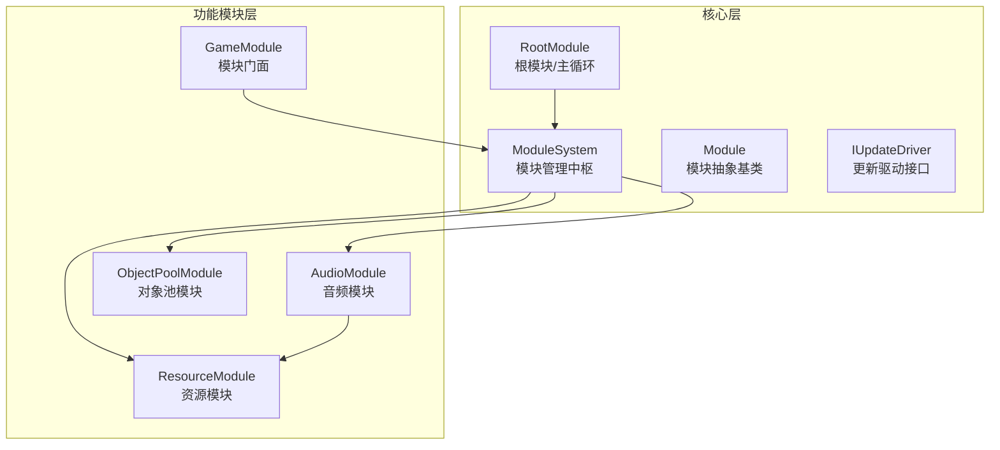
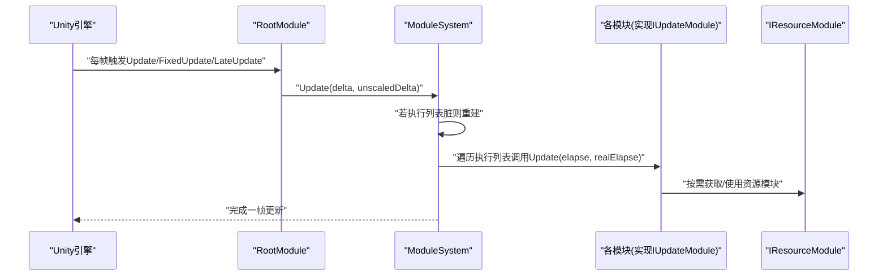
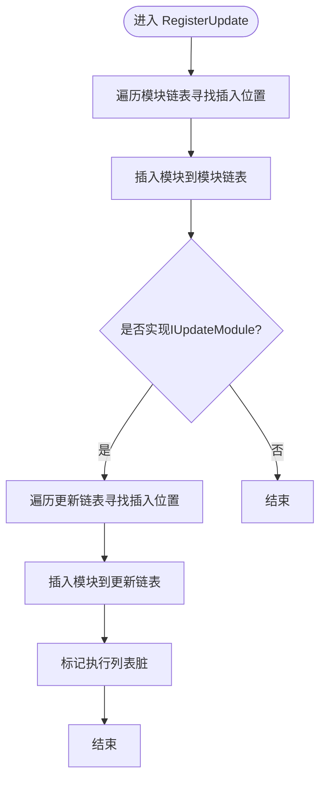
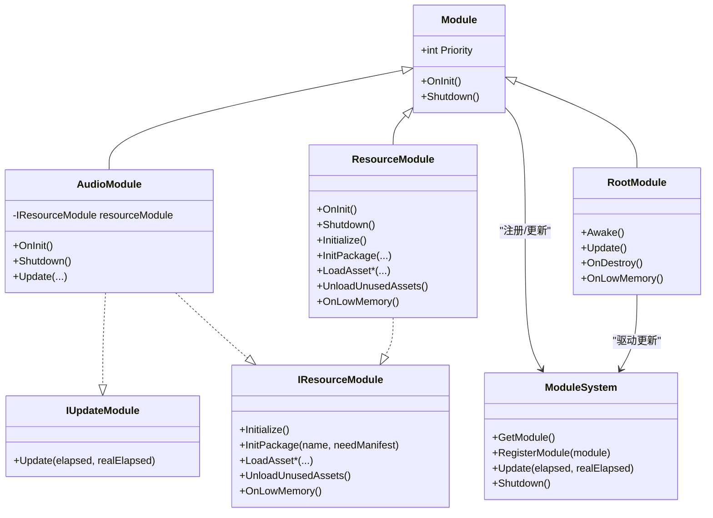
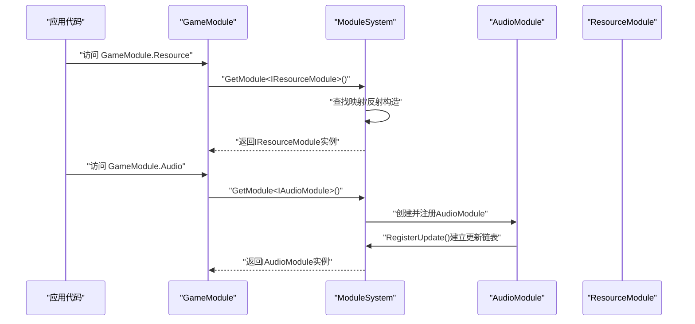
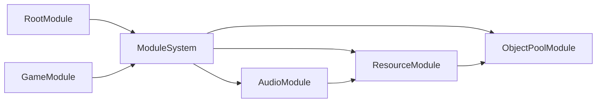

# 模块系统概述

<cite>
**本文档引用的文件**
- [ModuleSystem.cs](file://Assets/TEngine/Runtime/Core/ModuleSystem.cs)
- [Module.cs](file://Assets/TEngine/Runtime/Core/Module.cs)
- [RootModule.cs](file://Assets/TEngine/Runtime/Module/RootModule.cs)
- [IUpdateDriver.cs](file://Assets/TEngine/Runtime/Module/UpdataDriver/IUpdateDriver.cs)
- [IResourceModule.cs](file://Assets/TEngine/Runtime/Module/ResourceModule/IResourceModule.cs)
- [AudioModule.cs](file://Assets/TEngine/Runtime/Module/AudioModule/AudioModule.cs)
- [ObjectPoolModule.cs](file://Assets/TEngine/Runtime/Module/ObjectPoolModule/ObjectPoolModule.cs)
- [ResourceModule.cs](file://Assets/TEngine/Runtime/Module/ResourceModule/ResourceModule.cs)
- [GameModule.cs](file://Assets/GameScripts/HotFix/GameLogic/GameModule.cs)
</cite>

## 目录
1. [引言](#引言)
2. [项目结构](#项目结构)
3. [核心组件](#核心组件)
4. [架构总览](#架构总览)
5. [详细组件分析](#详细组件分析)
6. [依赖关系分析](#依赖关系分析)
7. [性能考量](#性能考量)
8. [故障排查指南](#故障排查指南)
9. [结论](#结论)
10. [附录](#附录)

## 引言
本文件面向TEngine框架的模块系统，系统性阐述其设计理念、架构原理与实现细节。重点覆盖以下方面：
- ModuleSystem作为模块管理中枢的职责与工作机制
- 模块注册、发现与生命周期管理
- 模块接口设计原则（如IUpdateModule、IResourceModule）
- 模块间解耦与依赖注入方式
- 模块从注册到使用的完整生命周期流程
- 类图与交互流程图
- 模块扩展最佳实践与性能优化建议

## 项目结构
TEngine的模块系统由“核心层”和“功能模块层”组成：
- 核心层：ModuleSystem负责模块注册、调度与生命周期；Module定义模块抽象与优先级；RootModule承载主循环与全局初始化
- 功能模块层：各业务模块（如音频、资源、对象池、UI等）继承Module并实现各自接口
- 接口驱动层：IUpdateDriver提供对Unity生命周期事件的注入能力，便于模块在不同帧阶段挂接逻辑

图表来源
- [ModuleSystem.cs:1-208](file://Assets/TEngine/Runtime/Core/ModuleSystem.cs#L1-L208)
- [Module.cs:1-40](file://Assets/TEngine/Runtime/Core/Module.cs#L1-L40)
- [RootModule.cs:1-304](file://Assets/TEngine/Runtime/Module/RootModule.cs#L1-L304)
- [IUpdateDriver.cs:1-120](file://Assets/TEngine/Runtime/Module/UpdataDriver/IUpdateDriver.cs#L1-L120)
- [AudioModule.cs:1-571](file://Assets/TEngine/Runtime/Module/AudioModule/AudioModule.cs#L1-L571)
- [ObjectPoolModule.cs:1-800](file://Assets/TEngine/Runtime/Module/ObjectPoolModule/ObjectPoolModule.cs#L1-L800)
- [ResourceModule.cs:1-800](file://Assets/TEngine/Runtime/Module/ResourceModule/ResourceModule.cs#L1-L800)
- [GameModule.cs:1-118](file://Assets/GameScripts/HotFix/GameLogic/GameModule.cs#L1-L118)

章节来源
- [ModuleSystem.cs:1-208](file://Assets/TEngine/Runtime/Core/ModuleSystem.cs#L1-L208)
- [Module.cs:1-40](file://Assets/TEngine/Runtime/Core/Module.cs#L1-L40)
- [RootModule.cs:1-304](file://Assets/TEngine/Runtime/Module/RootModule.cs#L1-L304)
- [IUpdateDriver.cs:1-120](file://Assets/TEngine/Runtime/Module/UpdataDriver/IUpdateDriver.cs#L1-L120)
- [AudioModule.cs:1-571](file://Assets/TEngine/Runtime/Module/AudioModule/AudioModule.cs#L1-L571)
- [ObjectPoolModule.cs:1-800](file://Assets/TEngine/Runtime/Module/ObjectPoolModule/ObjectPoolModule.cs#L1-L800)
- [ResourceModule.cs:1-800](file://Assets/TEngine/Runtime/Module/ResourceModule/ResourceModule.cs#L1-L800)
- [GameModule.cs:1-118](file://Assets/GameScripts/HotFix/GameLogic/GameModule.cs#L1-L118)

## 核心组件
- ModuleSystem：静态管理器，维护模块字典、更新链表与执行列表，提供模块获取、注册、更新与关闭能力
- Module：模块抽象基类，定义优先级、OnInit、Shutdown等生命周期方法
- RootModule：Unity入口模块，负责初始化日志、文本、JSON辅助器，设置帧率与时间缩放，并在每帧调用ModuleSystem.Update
- IUpdateDriver：对Unity Update/FixedUpdate/LateUpdate及生命周期事件的注入接口，便于模块挂接
- IResourceModule：资源模块接口，统一资源加载、卸载、清单与下载器管理
- GameModule：应用侧模块门面，提供静态属性访问各模块实例，简化上层调用

章节来源
- [ModuleSystem.cs:1-208](file://Assets/TEngine/Runtime/Core/ModuleSystem.cs#L1-L208)
- [Module.cs:1-40](file://Assets/TEngine/Runtime/Core/Module.cs#L1-L40)
- [RootModule.cs:1-304](file://Assets/TEngine/Runtime/Module/RootModule.cs#L1-L304)
- [IUpdateDriver.cs:1-120](file://Assets/TEngine/Runtime/Module/UpdataDriver/IUpdateDriver.cs#L1-L120)
- [IResourceModule.cs:1-356](file://Assets/TEngine/Runtime/Module/ResourceModule/IResourceModule.cs#L1-L356)
- [GameModule.cs:1-118](file://Assets/GameScripts/HotFix/GameLogic/GameModule.cs#L1-L118)

## 架构总览
模块系统通过RootModule承载主循环，每帧触发ModuleSystem.Update，后者按优先级顺序遍历IUpdateModule实现并调用其Update。模块注册时自动建立更新链表与执行列表，关闭时逆序销毁并清空缓存。

图表来源
- [RootModule.cs:140-154](file://Assets/TEngine/Runtime/Module/RootModule.cs#L140-L154)
- [ModuleSystem.cs:29-42](file://Assets/TEngine/Runtime/Core/ModuleSystem.cs#L29-L42)
- [IResourceModule.cs:12-356](file://Assets/TEngine/Runtime/Module/ResourceModule/IResourceModule.cs#L12-L356)

## 详细组件分析

### ModuleSystem：模块管理中枢
- 设计要点
  - 使用字典映射模块类型到实例，支持按接口类型动态解析与创建
  - 维护两个有序链表：模块链表（按优先级插入）与更新链表（仅含IUpdateModule）
  - 通过标记“执行列表脏”延迟重建，降低频繁重建开销
- 关键流程
  - GetModule<T>()：校验接口类型，尝试从映射中获取；若不存在，基于命名约定反射构造
  - RegisterModule<T>()：显式注册自定义模块实例
  - RegisterUpdate()：插入模块到模块链表与更新链表，并标记执行列表脏
  - BuildExecuteList()：将更新链表转换为顺序执行列表
  - Update()：按执行列表顺序调用各模块Update
  - Shutdown()：逆序关闭模块并清空容器，触发内存池与非托管缓存清理

图表来源
- [ModuleSystem.cs:143-194](file://Assets/TEngine/Runtime/Core/ModuleSystem.cs#L143-L194)

章节来源
- [ModuleSystem.cs:1-208](file://Assets/TEngine/Runtime/Core/ModuleSystem.cs#L1-L208)

### Module：模块抽象与优先级
- 设计要点
  - 定义优先级字段，影响模块注册顺序与关闭顺序
  - 抽象OnInit/Shutdown，强制模块实现生命周期钩子
- 优先级策略
  - 高优先级模块先注册、后关闭，确保关键模块在位
  - 更新链表同样按优先级排序，保证更新顺序可控

章节来源
- [Module.cs:1-40](file://Assets/TEngine/Runtime/Core/Module.cs#L1-L40)

### RootModule：主循环与全局初始化
- 设计要点
  - 在Awake中初始化文本、日志、JSON辅助器，设置帧率、时间缩放、后台运行与休眠策略
  - 每帧调用ModuleSystem.Update，驱动所有模块更新
  - OnDestroy中触发ModuleSystem.Shutdown，确保资源回收
  - OnLowMemory中联动对象池与资源模块的低内存处理
- 与模块系统的交互
  - 作为模块系统的“调度者”，将Unity帧循环桥接到ModuleSystem.Update

章节来源
- [RootModule.cs:116-167](file://Assets/TEngine/Runtime/Module/RootModule.cs#L116-L167)
- [RootModule.cs:287-302](file://Assets/TEngine/Runtime/Module/RootModule.cs#L287-L302)

### IUpdateDriver：更新驱动接口
- 设计要点
  - 提供协程启动/停止、Unity生命周期事件注入（Update/FixedUpdate/LateUpdate、Destroy、OnDrawGizmos等）
  - 为模块提供统一的帧更新与事件订阅/反订阅机制，降低对Unity API的直接耦合
- 价值
  - 使模块可在不同帧阶段挂接逻辑，提升模块的可测试性与解耦度

章节来源
- [IUpdateDriver.cs:1-120](file://Assets/TEngine/Runtime/Module/UpdataDriver/IUpdateDriver.cs#L1-L120)

### IResourceModule：资源模块接口
- 设计要点
  - 统一资源版本、运行模式、加密方式、下载并发与失败重试等配置
  - 提供资源加载（同步/异步/句柄）、卸载、清单请求与更新、下载器创建、低内存回收等能力
  - 支持多包管理与WebGL特殊加载路径
- 与模块协作
  - 模块通过ModuleSystem.GetModule<IResourceModule>()获取资源能力，按需加载与卸载资源

章节来源
- [IResourceModule.cs:1-356](file://Assets/TEngine/Runtime/Module/ResourceModule/IResourceModule.cs#L1-L356)

### GameModule：模块门面与依赖注入
- 设计要点
  - 以静态属性形式暴露各模块接口，内部通过ModuleSystem.GetModule<T>()获取实例
  - 提供Shutdown重置静态缓存的能力，便于场景切换或退出时清理
- 价值
  - 为上层逻辑提供统一的模块访问入口，隐藏模块系统细节

章节来源
- [GameModule.cs:1-118](file://Assets/GameScripts/HotFix/GameLogic/GameModule.cs#L1-L118)

### 典型模块：AudioModule 与 ResourceModule
- AudioModule
  - 依赖IResourceModule进行音频资源加载与对象池管理
  - 实现IUpdateModule，按帧更新各类音频代理
- ResourceModule
  - 实现IResourceModule，封装YooAsset运行模式、下载器与清单管理
  - 通过ModuleSystem获取对象池模块以优化资源对象复用

图表来源
- [Module.cs:1-40](file://Assets/TEngine/Runtime/Core/Module.cs#L1-L40)
- [ModuleSystem.cs:1-208](file://Assets/TEngine/Runtime/Core/ModuleSystem.cs#L1-L208)
- [RootModule.cs:1-304](file://Assets/TEngine/Runtime/Module/RootModule.cs#L1-L304)
- [IUpdateDriver.cs:1-120](file://Assets/TEngine/Runtime/Module/UpdataDriver/IUpdateDriver.cs#L1-L120)
- [IResourceModule.cs:1-356](file://Assets/TEngine/Runtime/Module/ResourceModule/IResourceModule.cs#L1-L356)
- [AudioModule.cs:1-571](file://Assets/TEngine/Runtime/Module/AudioModule/AudioModule.cs#L1-L571)
- [ResourceModule.cs:1-800](file://Assets/TEngine/Runtime/Module/ResourceModule/ResourceModule.cs#L1-L800)

章节来源
- [AudioModule.cs:1-571](file://Assets/TEngine/Runtime/Module/AudioModule/AudioModule.cs#L1-L571)
- [ResourceModule.cs:1-800](file://Assets/TEngine/Runtime/Module/ResourceModule/ResourceModule.cs#L1-L800)

### 模块注册与发现流程
- 接口获取路径
  - 上层通过GameModule静态属性或直接调用ModuleSystem.GetModule<T>()获取模块
  - GameModule.Get<T>() 内部包含 Unity fake-null 检查，防止返回已被 Destroy 的模块实例，并通过 Log.Assert 确保模块有效性
  - 若模块未注册，GetModule<T>()会基于命名约定反射构造对应模块类型
- 注册路径
  - 显式注册：ModuleSystem.RegisterModule<T>(module)将自定义实例绑定到接口类型
  - 隐式注册：首次获取时自动创建并注册，同时建立更新链表与执行列表

图表来源
- [GameModule.cs:48-101](file://Assets/GameScripts/HotFix/GameLogic/GameModule.cs#L48-L101)
- [ModuleSystem.cs:68-120](file://Assets/TEngine/Runtime/Core/ModuleSystem.cs#L68-L120)
- [AudioModule.cs:322-332](file://Assets/TEngine/Runtime/Module/AudioModule/AudioModule.cs#L322-L332)

章节来源
- [GameModule.cs:1-118](file://Assets/GameScripts/HotFix/GameLogic/GameModule.cs#L1-L118)
- [ModuleSystem.cs:1-208](file://Assets/TEngine/Runtime/Core/ModuleSystem.cs#L1-L208)

## 依赖关系分析
- 模块间依赖
  - AudioModule依赖IResourceModule进行资源加载与对象池管理
  - ResourceModule依赖对象池模块进行资源对象复用
  - RootModule依赖ModuleSystem进行模块更新与关闭
- 解耦机制
  - 通过接口隔离（IResourceModule、IUpdateModule）与静态门面（GameModule）降低耦合
  - 通过ModuleSystem集中管理模块生命周期，避免跨模块直接依赖

图表来源
- [RootModule.cs:116-167](file://Assets/TEngine/Runtime/Module/RootModule.cs#L116-L167)
- [ModuleSystem.cs:1-208](file://Assets/TEngine/Runtime/Core/ModuleSystem.cs#L1-L208)
- [AudioModule.cs:320-332](file://Assets/TEngine/Runtime/Module/AudioModule/AudioModule.cs#L320-L332)
- [ObjectPoolModule.cs:1-800](file://Assets/TEngine/Runtime/Module/ObjectPoolModule/ObjectPoolModule.cs#L1-L800)
- [ResourceModule.cs:1-800](file://Assets/TEngine/Runtime/Module/ResourceModule/ResourceModule.cs#L1-L800)
- [GameModule.cs:1-118](file://Assets/GameScripts/HotFix/GameLogic/GameModule.cs#L1-L118)

章节来源
- [AudioModule.cs:1-571](file://Assets/TEngine/Runtime/Module/AudioModule/AudioModule.cs#L1-L571)
- [ObjectPoolModule.cs:1-800](file://Assets/TEngine/Runtime/Module/ObjectPoolModule/ObjectPoolModule.cs#L1-L800)
- [ResourceModule.cs:1-800](file://Assets/TEngine/Runtime/Module/ResourceModule/ResourceModule.cs#L1-L800)
- [GameModule.cs:1-118](file://Assets/GameScripts/HotFix/GameLogic/GameModule.cs#L1-L118)

## 性能考量
- 执行列表延迟重建
  - 通过“执行列表脏标记”避免每次更新都重建列表，降低GC与CPU开销
- 优先级插入排序
  - 插入链表时按优先级查找位置，保持模块注册与更新顺序稳定
- 资源加载优化
  - ResourceModule提供对象池与句柄复用，减少重复加载与分配
  - 支持WebGL与多运行模式参数，按平台特性选择最优加载路径
- 内存回收
  - RootModule在低内存事件中联动对象池与资源模块回收未使用资源
  - ModuleSystem.Shutdown清空容器并释放非托管缓存，防止泄漏

章节来源
- [ModuleSystem.cs:199-206](file://Assets/TEngine/Runtime/Core/ModuleSystem.cs#L199-L206)
- [RootModule.cs:287-302](file://Assets/TEngine/Runtime/Module/RootModule.cs#L287-L302)
- [ResourceModule.cs:412-447](file://Assets/TEngine/Runtime/Module/ResourceModule/ResourceModule.cs#L412-L447)

## 故障排查指南
- 获取模块失败
  - 症状：调用GetModule<T>()抛出异常
  - 可能原因：传入非接口类型、反射构造失败、模块未正确注册
  - 处理：确认泛型参数为接口类型；检查命名约定与程序集可见性；必要时使用RegisterModule<T>()显式注册
- 模块未更新
  - 症状：模块未进入Update循环
  - 可能原因：未实现IUpdateModule；优先级导致插入位置错误
  - 处理：确保模块实现IUpdateModule；核对Priority值
- 资源加载异常
  - 症状：资源定位无效或加载失败
  - 可能原因：包名错误、清单未更新、WebGL加载路径问题
  - 处理：检查包名与默认包设置；调用清单更新接口；确认WebGL加载模式

章节来源
- [ModuleSystem.cs:68-120](file://Assets/TEngine/Runtime/Core/ModuleSystem.cs#L68-L120)
- [IResourceModule.cs:146-147](file://Assets/TEngine/Runtime/Module/ResourceModule/IResourceModule.cs#L146-L147)
- [ResourceModule.cs:314-341](file://Assets/TEngine/Runtime/Module/ResourceModule/ResourceModule.cs#L314-L341)

## 结论
TEngine模块系统通过清晰的抽象与集中管理，实现了模块的高内聚、低耦合与可扩展性。ModuleSystem承担中枢职责，RootModule提供主循环，接口驱动模块在不同帧阶段挂接逻辑，模块间通过接口与静态门面解耦。配合延迟重建执行列表、对象池与多运行模式等优化手段，系统在性能与可维护性之间取得良好平衡。

## 附录
- 模块扩展最佳实践
  - 优先实现接口而非直接继承，便于替换与测试
  - 正确设置Priority，确保模块注册与关闭顺序符合业务需求
  - 在OnInit中完成轻量初始化，在Update中处理高频逻辑
  - 通过IResourceModule统一资源访问，避免跨模块直接依赖
- 模块生命周期建议
  - 注册：首次使用时自动注册；必要时显式RegisterModule<T>()
  - 运行：实现IUpdateModule并在Update中处理业务
  - 关闭：在Shutdown中释放资源、注销事件与回调
- 性能优化建议
  - 减少反射次数：尽量显式注册常用模块
  - 合理拆分模块：避免单模块承担过多职责
  - 利用对象池与句柄：降低频繁分配与加载成本
  - 平台适配：针对WebGL与移动端调整运行模式与参数